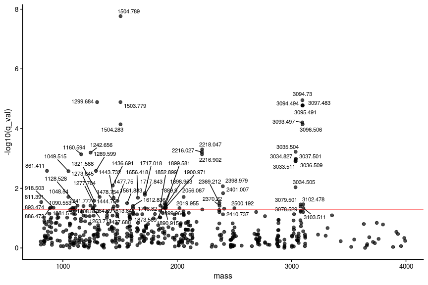
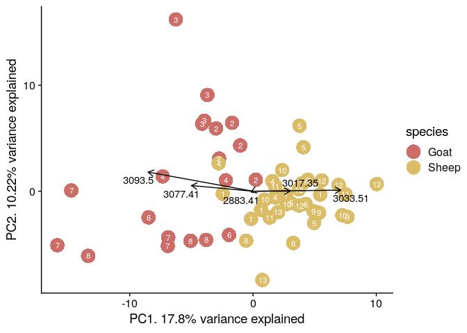
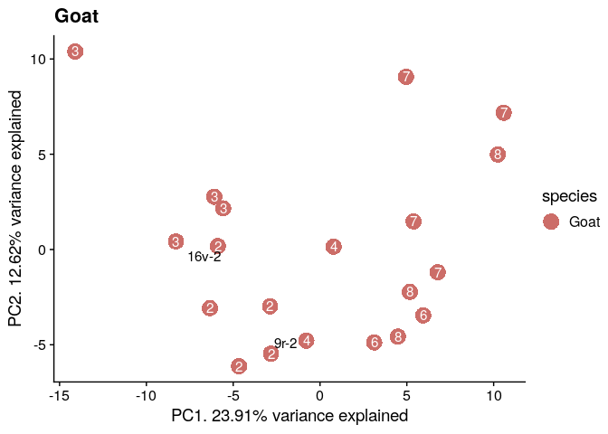

R Notebook
================

``` r
library(MALDIquantForeign)
```

    ## Loading required package: MALDIquant

    ## 
    ## This is MALDIquant version 1.21
    ## Quantitative Analysis of Mass Spectrometry Data
    ##  See '?MALDIquant' for more information about this package.

``` r
library(MALDIquant)
library(tidyverse)
```

    ## ── Attaching packages ─────────────────────────────────────── tidyverse 1.3.1 ──

    ## ✔ ggplot2 3.3.6     ✔ purrr   0.3.4
    ## ✔ tibble  3.1.7     ✔ dplyr   1.0.9
    ## ✔ tidyr   1.2.0     ✔ stringr 1.4.0
    ## ✔ readr   2.1.2     ✔ forcats 0.5.1

    ## ── Conflicts ────────────────────────────────────────── tidyverse_conflicts() ──
    ## ✖ dplyr::filter() masks stats::filter()
    ## ✖ dplyr::lag()    masks stats::lag()

``` r
library(parallel)
library(cowplot)
library(ggpubr)
```

    ## 
    ## Attaching package: 'ggpubr'

    ## The following object is masked from 'package:cowplot':
    ## 
    ##     get_legend

``` r
library(ggrepel)
library(sva)
```

    ## Loading required package: mgcv

    ## Loading required package: nlme

    ## 
    ## Attaching package: 'nlme'

    ## The following object is masked from 'package:dplyr':
    ## 
    ##     collapse

    ## This is mgcv 1.8-40. For overview type 'help("mgcv-package")'.

    ## Loading required package: genefilter

    ## 
    ## Attaching package: 'genefilter'

    ## The following object is masked from 'package:readr':
    ## 
    ##     spec

    ## Loading required package: BiocParallel

``` r
library(binda)
```

    ## Loading required package: entropy

``` r
library(sda)
```

    ## Loading required package: corpcor

    ## Loading required package: fdrtool

``` r
library(limma)
library(pheatmap)
library(RColorBrewer)
library(viridis)
```

    ## Loading required package: viridisLite

``` r
backup_options = options()
backup_par = par()
```

# Data analysis of the preprocessed MALDI data

We analyse the preprocessed MALDI data in the form of feature matrices,
where samples are the rows and each feature/mass/peak/peptide the
columns; the matrix cells are filled with the processed intensity
values.

``` r
basepath = '~/palaeoproteomics/MALDI/spanish_book'
data_folder = file.path(basepath, 'data')
results_folder = file.path(basepath, 'results')

# -----------------------------------------------------------------------------------------
# Read metadata
uoc_metadata = read.csv(file.path(data_folder,'uoc_metadata.csv'))
uoc_metadata = uoc_metadata %>%
  mutate(group = as.factor(group), book = as.factor(book), side = as.factor(side),
         batch = as.factor(batch)) %>% as_tibble()

# -----------------------------------------------------------------------------------------
# Read feature matrix
snr = 5
featMatrix = read_csv(file.path(data_folder,
                                paste0('featureMatrix_',snr,'.csv')),
                      show_col_types = F) %>%
  as.matrix()
colnames(featMatrix) = as.character(round(as.numeric(colnames(featMatrix)),3))
rownames(featMatrix) = uoc_metadata$sample.name
# Scale
scaledFeatMatrix = apply(featMatrix, 2, function(x) (x)/sqrt(var(x)))
```

## Surrogate varaible analysis

First of all we will use the `sva` package to estimate and regress out
the surrogate variables. For this, we will tell the algorithm which are
our variables of interest, *species* and *book* and we will let it
determine unwanted sources of variation, among which we have the batch.

``` r
# Prepare models for SVA analyis
mod = model.matrix(~species+group, data = uoc_metadata)
mod0 = model.matrix(~1, data=uoc_metadata)
# Remove surrogate variables
# sva
n.sv = num.sv(t(scaledFeatMatrix), mod, method='be', B=47)
svobj = sva(t(scaledFeatMatrix), mod, mod0, n.sv=n.sv)
```

    ## Number of significant surrogate variables is:  6 
    ## Iteration (out of 5 ):1  2  3  4  5

``` r
colnames(svobj$sv) = paste0('SV', 1:n.sv)
# Fix data
brSVA = fsva(dbdat=t(scaledFeatMatrix), mod=mod, sv=svobj, newdat=t(scaledFeatMatrix))
brSVA = brSVA$db
```

We can calculate F-test for each of the masses to have a preliminary
idea of whether they have differences in the different species and books

``` r
# Add surrogate variables to model and estimate pvalues
modSV = cbind(mod, svobj$sv)
mod0SV = cbind(mod0, svobj$sv)
# Calc fstatistics
pValuesSv = f.pvalue(t(scaledFeatMatrix), modSV, mod0SV)
qValuesSv = sort(p.adjust(pValuesSv, method="BH"))

sv_qval = tibble(mass = as.numeric(names(qValuesSv)), q_val = qValuesSv)
sv_qval %>% filter(q_val < 0.05)
```

    ## # A tibble: 73 × 2
    ##     mass        q_val
    ##    <dbl>        <dbl>
    ##  1 1505. 0.0000000171
    ##  2 3095. 0.0000112   
    ##  3 1300. 0.0000130   
    ##  4 1504. 0.0000130   
    ##  5 3097. 0.0000167   
    ##  6 3094. 0.0000167   
    ##  7 3095. 0.0000167   
    ##  8 3093. 0.0000620   
    ##  9 1504. 0.0000719   
    ## 10 3097. 0.0000719   
    ## # … with 63 more rows

``` r
pl = ggplot(sv_qval) +
    geom_point(aes(x=mass, y=-log10(q_val)), size=2, alpha=0.7) +
    geom_hline(yintercept=-log10(0.05), color='red') +
    geom_text_repel(aes(x=mass, y=-log10(q_val), label=ifelse(q_val<0.05, mass, '')), size=4) +
    theme_cowplot() +
    theme(axis.title=element_text(size=12), axis.text=element_text(size=10))
pl
```

    ## Warning: ggrepel: 34 unlabeled data points (too many overlaps). Consider
    ## increasing max.overlaps

<!-- -->

``` r
ggsave('f_stats_pval.png', pl, path = results_folder, bg='white',
       width = 9, height = 6, dpi=100)
```

    ## Warning: ggrepel: 34 unlabeled data points (too many overlaps). Consider
    ## increasing max.overlaps

``` r
ggsave('f_stats_pval.svg', pl, path = results_folder, bg='white',
       width = 9, height = 6, dpi=100)
```

    ## Warning: ggrepel: 35 unlabeled data points (too many overlaps). Consider
    ## increasing max.overlaps

## Data visualization and clustering

We perform a hierarchical clustering on the samples and a PCA.

### Hierarchical cluster

``` r
# Hierarchical cluster
h = hclust(dist(t(brSVA)), method='ward.D2')
png(file.path(results_folder,'hier_clust.png'),
    width = 12, height = 6, units = 'in', res = 100)

svg(file.path(results_folder,'hier_clust.svg'),
    width = 12, height = 6)
a = plot(h, labels=paste0(uoc_metadata$folia, uoc_metadata$side, '-', uoc_metadata$group, '-',
                      uoc_metadata$species, collapse = NULL),
     ylab='Distance', xlab='Sample', axes=FALSE, sub='', main='Hierarchical clustering',
     cex=1
    )
dev.off()
```

    ## png 
    ##   2

``` r
plot(h, labels=paste0(uoc_metadata$folia, uoc_metadata$side, '-', uoc_metadata$group, '-',
                      uoc_metadata$species, collapse = NULL),
     ylab='Distance', xlab='Sample', axes=FALSE, sub='', main='Hierarchical clustering',
     cex=1
    )
```

<!-- -->

### Heatmap

``` r
annot = uoc_metadata %>%
    column_to_rownames('sample.name') %>%
    as.data.frame() %>%
    select(species, book)
cl = paste0(uoc_metadata$folia, uoc_metadata$side, '-', uoc_metadata$group, collapse = NULL)

ann_colors = list(
    species = c(Goat = "#CC6D68", Sheep = "#DBBD68"), 
    book = c("1" = "#238A8DFF", "2" = "#4B2991")
)
col2 = colorRampPalette(c("white","#EACDC2", "#B75D69", "#774C80", "#372549", "#1A1423"))

hm = pheatmap(
  brSVA, annotation_col = annot, annotation_colors = ann_colors,
  color=col2(8), treeheight_row = 0, show_rownames = F,
  clustering_method = 'ward.D2', labels_col = cl, cutree_col=5,
  annotation_names_col = F, fontsize = 8, cex=1)
hm
```

<!-- -->

``` r
ggsave('heatmap.png', hm, path=results_folder, width = 9, height = 7,
       dpi=100, bg='white')
ggsave('heatmap.svg', hm, path=results_folder, width = 9, height = 7,
       dpi=100, bg='white')

#flip plot
hm_fl = pheatmap(
  t(brSVA), annotation_row = annot, annotation_colors = ann_colors,
  color=col2(8), treeheight_col = 0, show_colnames = F,
  clustering_method = 'ward.D2', labels_row = cl, cutree_row=5,
  annotation_names_row= F, fontsize = 8, cex=1)
hm_fl
```

<!-- -->

``` r
ggsave('heatmap_flipped.png', hm_fl, path=results_folder, width = 9, height = 7,
       dpi=100, bg='white')
ggsave('heatmap_flipped.svg', hm_fl, path=results_folder, width = 9, height = 7,
       dpi=100, bg='white')
```

### PCA

``` r
masses = as.numeric(colnames(scaledFeatMatrix))
peptides = c(2883, 3017, 3033, 3077, 3093)

mask1 = masses > peptides[1] & masses < peptides[1]+1
mask2 = masses > peptides[2] & masses < peptides[2]+1
mask3 = masses > peptides[3] & masses < peptides[3]+1
mask4 = masses > peptides[4] & masses < peptides[4]+1
mask5 = masses > peptides[5] & masses < peptides[5]+1


batch_rem_pc = prcomp(t(brSVA))
batch_rem_pc_x = as.data.frame(batch_rem_pc$x)
batch_rem_pc_x = cbind(batch_rem_pc_x, uoc_metadata)
perc_var = round(batch_rem_pc$sdev^2*100/sum(batch_rem_pc$sdev^2), 2)

loadings = batch_rem_pc$rotation[, c(1,2,3)] * batch_rem_pc$sdev[c(1,2,3)]
toppc1_loadings = loadings[order(loadings[,'PC1'], decreasing=T),]
plot_loadings = loadings[mask1| mask2 | mask3 | mask4 | mask5, ] * 10

mass_labels = masses[mask1 | mask2 | mask3 | mask4 | mask5]

# PC1 vs PC2
p1 = ggplot(batch_rem_pc_x) +
  geom_point(mapping = aes (x=PC1, y=PC2, color=species),
             size=6, shape=16, stroke=2) +
  xlab(paste0('PC1. ', perc_var[1], "% variance explained")) +
  ylab(paste0('PC2. ', perc_var[2], "% variance explained")) +
  scale_color_manual(values= c(Goat = "#CC6D68", Sheep = "#DBBD68")) + 
  geom_text(mapping = aes(x=PC1, y=PC2, label=as.character(group)),
            color="white", size=3) +
  theme_cowplot()
p1
```

<!-- -->

``` r
p2 = p1 +
  geom_segment(lineend = "butt", linejoin = "round", arrow = arrow(length = unit(0.1, "inches")),
              mapping=aes(xend=PC1,yend=PC2,x=rep(0,5), y=rep(0,5)),
              data=as.data.frame(plot_loadings)) +
  geom_text_repel(mapping=aes(x=PC1, y=PC2,label=as.character(round(as.numeric(mass),2))),
                 data=as.data.frame(plot_loadings) %>% rownames_to_column('mass'))

p2
```

<!-- -->

``` r
ggsave("pca.png", plot=p1, device="png", dpi=100, path=results_folder,
       bg="white")
```

    ## Saving 7 x 5 in image

``` r
ggsave("pca.svg", plot=p1, device="svg", dpi=100, path=results_folder,
       bg="white")
```

    ## Saving 7 x 5 in image

``` r
ggsave("pca_loads.png", plot=p2, device="png", dpi=100, path=results_folder,
       bg="white")
```

    ## Saving 7 x 5 in image

``` r
ggsave("pca_loads.svg", plot=p2, device="svg", dpi=100, path=results_folder,
       bg="white")
```

    ## Saving 7 x 5 in image

## Separate species

``` r
# Separate sheep and goat matrices
mat_sheep = brSVA[, uoc_metadata$species == 'Sheep']
mat_goat = brSVA[, uoc_metadata$species == 'Goat']
#Annotations for sheep and goat
uoc_metadata_sheep = uoc_metadata %>% filter(species == 'Sheep')
uoc_metadata_goat = uoc_metadata %>% filter(species == 'Goat')

annot_sheep = uoc_metadata_sheep %>%
  column_to_rownames('sample.name') %>%
  as.data.frame() %>%
  select(species)
cl_sheep = paste0(uoc_metadata_sheep$folia, uoc_metadata_sheep$side, '-', uoc_metadata_sheep$group, collapse = NULL)

annot_goat = uoc_metadata_goat %>%
  column_to_rownames('sample.name') %>%
  as.data.frame() %>%
  select(species)
cl_goat = paste0(uoc_metadata_goat$folia, uoc_metadata_goat$side, '-', uoc_metadata_goat$group, collapse = NULL)
```

### PCA by species

``` r
sheep_pca = prcomp(t(mat_sheep))
sheep_pca_x = as.data.frame(sheep_pca$x)
sheep_pca_x = cbind(sheep_pca_x, uoc_metadata_sheep)
sheep_pca_x = sheep_pca_x %>% mutate(
  label = ifelse(folia==89|folia==1|folia==8|folia==97,
                 paste0(folia, side, '-', group, collapse = NULL),
                 ""))

perc_var = round(sheep_pca$sdev^2*100/sum(sheep_pca$sdev^2), 2)

# PC1 vs PC2
sheep_pca_plot = ggplot(sheep_pca_x) +
  geom_point(mapping = aes (x=PC1, y=PC2, color=species),
             size=5, shape=16, stroke=2) +
  xlab(paste0('PC1. ', perc_var[1], "% variance explained")) +
  ylab(paste0('PC2. ', perc_var[2], "% variance explained")) +
  scale_color_manual(values= c(Sheep = "#DBBD68")) + 
  geom_text(mapping = aes(x=PC1, y=PC2, label=as.character(group)),
            color="white", size=3) +
  geom_text_repel(mapping = aes(x=PC1, y=PC2, label=label),
            color="black", size=4) +
  theme_cowplot() +
  ggtitle("Sheep")
sheep_pca_plot
```

<!-- -->

``` r
goat_pca = prcomp(t(mat_goat))
goat_pca_x = as.data.frame(goat_pca$x)
goat_pca_x = cbind(goat_pca_x, uoc_metadata_goat)
goat_pca_x = goat_pca_x %>% mutate(
  label = ifelse(folia==16|folia==9,
                 paste0(folia, side, '-', group, collapse = NULL),
                 ""))
perc_var = round(goat_pca$sdev^2*100/sum(goat_pca$sdev^2), 2)

# PC1 vs PC2
goat_pca_plot = ggplot(goat_pca_x) +
  geom_point(mapping = aes (x=PC1, y=PC2, color=species),
             size=5, shape=16, stroke=2) +
  xlab(paste0('PC1. ', perc_var[1], "% variance explained")) +
  ylab(paste0('PC2. ', perc_var[2], "% variance explained")) +
  scale_color_manual(values= c(Goat = "#CC6D68")) + 
  geom_text(mapping = aes(x=PC1, y=PC2, label=as.character(group)),
            color="white", size=4) +
  geom_text_repel(mapping = aes(x=PC1, y=PC2, label=label),
            color="black", size=4) +
  theme_cowplot() +
  ggtitle("Goat")
goat_pca_plot
```

<!-- -->

``` r
ggsave("pca_sheep.png", plot=sheep_pca_plot, device="png", dpi=100, path=results_folder,
       bg="white")
```

    ## Saving 7 x 5 in image

``` r
ggsave("pca_sheep.svg", plot=sheep_pca_plot, device="svg", dpi=100, path=results_folder,
       bg="white")
```

    ## Saving 7 x 5 in image

``` r
ggsave("pca_goat.png", plot=goat_pca_plot, device="png", dpi=100, path=results_folder,
       bg="white")
```

    ## Saving 7 x 5 in image

``` r
ggsave("pca_goat.svg", plot=goat_pca_plot, device="svg", dpi=100, path=results_folder,
       bg="white")
```

    ## Saving 7 x 5 in image

### Heatmap by species

``` r
#Heatmap for sheep

heatmap_sheep = pheatmap(
  t(mat_sheep),color=col2(8), treeheight_col = 0, show_colnames = F,
  clustering_method = 'ward.D2', labels_row = cl_sheep, cutree_row=3,
  fontsize = 8, main="Sheep")
heatmap_sheep
```

<!-- -->

``` r
ggsave("heatmap_sheep.png", plot=heatmap_sheep, device="png", dpi=100,
       path=results_folder, width = 9, height = 7)
ggsave("heatmap_sheep.svg", plot=heatmap_sheep, device="svg", dpi=100,
       path=results_folder, width = 9, height = 7)

#Heatmap for goat

heatmap_goat = pheatmap(
  t(mat_goat), color=col2(8), treeheight_col = 0, show_colnames = F,
  clustering_method = 'ward.D2', labels_row = cl_goat, cutree_row=2,
  main="Goat")
heatmap_goat
```

<!-- -->

``` r
ggsave("heatmap_goat.png", plot=heatmap_goat, device="png", dpi=100,
       path=results_folder, width = 9, height = 7)
ggsave("heatmap_goat.svg", plot=heatmap_goat, device="svg", dpi=100,
       path=results_folder, width = 9, height = 7)
```

## Statistical testing on each peptide

Here we build an statistical model for our data that includes the
contribution of the species and the book each sample beolongs to.

For sample
,
and feature peak
,
the observed intensity signal

is:

,

where

is the species contribution of the peak

and

is for the book. The model also accounts for the batch, through
parameter
.

In the process we follow the following steps:

1.  Fit model to the data to estimate all the
    
    and
    
    parameters.
2.  Define the contrasts we are interested in, in this case the
    difference between *sheep* and *goat* and the two books.
3.  Fit the contrasts: perform the statistical testing to the defined
    contrasts and calcualte the size and and significance of the
    contrasts. Adjust p-values for multi-testing.

The results are sumarised in a volcano plot, showing the size and
significance of the diferences. Finally we do several diagnostic plots
to determine if the assumptions are fulfilled.

``` r
# Models for peptides testing
LB_Bmod = model.matrix(~0+species+book+batch, data=uoc_metadata)

# fit model on batch corrected data
fit.LBB = lmFit(brSVA, LB_Bmod)

# Create contrasts
LBB.contrast = makeContrasts(
  species_contrast = 'speciesSheep - speciesGoat',
  book_contrast = 'book2',
  levels = LB_Bmod
)
```

### Test and plot

``` r
test.contrasts = function(fit, contr){
  fit2 = contrasts.fit(fit, contr)
  fit2 = eBayes(fit2, robust=T, trend=T)
  return(fit2)
}

diag_plots = function(fit2, base_main){
  par(mfrow=c(3,1))
  # SA Plot: avg vs dispersion
  plotSA(fit2, col=c('black', 'red'), cex=1.5, main='SA plot')
  # MA Plot: avg vs log2FC
  plotMA(fit2, cex=1.5, main='MA plot', status=p.adjust(fit2$F.p.value, method='BH')<0.05,
         value=T, legend=F)
  # p.values distriburtion
  hist(fit2$F.p.value, breaks=20, xlab='p-value',
       main='p-value distribution')
  title(base_main, line=1, outer = T, cex=2)
}

volc_plot = function(fit2, contr, base_main){
  # volcano plot per contrast coef: log2FC vs -log10pval
  # Also return a table with the data
  volcpl = list()
  ctrs = list()
  for (coef_idx in 1:length(colnames(contr))){
    volcdf = data.frame(mass=names(fit2$coefficients[,coef_idx]),
                        logFC = fit2$coeff[,coef_idx],
                        adj.p.val = p.adjust(fit2$p.value[,coef_idx], 'BH'),
                        p.val = fit2$p.value[,coef_idx],
                        stringsAsFactors = F)
    volcdf = volcdf %>%  mutate(l = ifelse(volcdf$adj.p.val <= 0.05, volcdf$mass, ''))
    DEstatus = cut(volcdf$adj.p.val, c(0,0.05,1))
    levels(DEstatus) = c('(0,0.05]','(0.05,1]')
    volcdf$DEstatus = DEstatus
    
    v = ggplot(volcdf, mapping = aes(x=logFC, y=-log10(adj.p.val))) +
      geom_point(mapping = aes(color=DEstatus)) +
      theme_cowplot() +
      ylab("-log10(FDR)") +
      geom_hline(yintercept = -log10(0.05), color='red') +
      scale_color_manual(name='FDR',
                         values=c('(0,0.05]'='#00BFC4','(0.05,1]'='#F8766D'),
                         na.value='grey66',
                         labels=c('FDR<=0.05','FDR>0.05')) +
      geom_text_repel(aes(label=l), color='black', size=3, max.overlaps = 20) +
      ggtitle(colnames(fit2$coeff)[coef_idx])
    
    v = v + theme(legend.position = 'right')

    ctrs[[colnames(fit2$coeff)[coef_idx]]] = volcdf
    volcpl[[coef_idx]] = v 
  }
  pl = ggarrange(plotlist = volcpl, nrow=1, ncol=length(colnames(contr)),
                common.legend = TRUE)
#   table = topTable(fit2, p.value=0.05, number=length(fit2$p.value))
#   table %>% rownames_to_column('mass') %>% write_csv(paste(base_file, '_table.csv', sep=''))
  a = list(ctrs, pl)
  return(a)
}
```

``` r
# Test contrasts and plot
fit2.LBB = test.contrasts(fit.LBB, LBB.contrast)
diag_plots(fit2.LBB, 'SV corrected data, batch as factor.')
```

<!-- -->

``` r
png(file.path(results_folder, 'model_diag_plots.png'),
    width=8, height=9, units='in', res=100)
diag_plots(fit2.LBB, 'SV corrected data, batch as factor.')
dev.off()
```

    ## png 
    ##   2

``` r
a = volc_plot(fit2.LBB, LBB.contrast,'SV corrected data, batch as factor.')
tables.LBB = a[[1]]
vcpl = a[[2]]
vcpl
```

    ## Warning: ggrepel: 23 unlabeled data points (too many overlaps). Consider
    ## increasing max.overlaps

<!-- -->

``` r
ggsave('volcano_plot.png', vcpl, path = results_folder, dpi=100, bg="white")
```

    ## Saving 11 x 7 in image

    ## Warning: ggrepel: 23 unlabeled data points (too many overlaps). Consider
    ## increasing max.overlaps

``` r
species.table = tables.LBB$species_contrast
book.table = tables.LBB$book_contrast

species_peps = species.table %>%
  filter(adj.p.val<=0.05) %>%
  arrange(adj.p.val) %>%
  dplyr::pull(mass) %>%
  as.numeric()

species.table %>%
  filter(adj.p.val<=0.05) %>%
  arrange(adj.p.val) %>%
  dplyr::select(-DEstatus)
```

    ##              mass      logFC    adj.p.val        p.val        l
    ## 3094.73   3094.73 -1.7880406 2.719426e-14 5.504910e-17  3094.73
    ## 1299.684 1299.684 -1.8845618 4.837938e-14 1.958679e-16 1299.684
    ## 3094.494 3094.494 -1.7399867 1.002425e-13 6.087601e-16 3094.494
    ## 3095.491 3095.491 -1.7230092 1.281181e-13 1.037394e-15 3095.491
    ## 3097.483 3097.483 -1.7402656 1.455334e-13 1.473011e-15 3097.483
    ## 3093.497 3093.497 -1.6661906 1.218309e-12 1.540972e-14 3093.497
    ## 3096.506 3096.506 -1.6734690 1.218309e-12 1.726349e-14 3096.506
    ## 2216.027 2216.027 -1.6231064 1.683217e-10 2.725857e-12 2216.027
    ## 2218.047 2218.047 -1.5760215 2.390647e-10 4.355431e-12 2218.047
    ## 1503.779 1503.779 -1.7503108 3.334784e-10 6.750575e-12 1503.779
    ## 1504.789 1504.789 -1.7925587 4.179874e-10 9.307412e-12 1504.789
    ## 2216.902 2216.902 -1.5887248 4.398137e-10 1.068373e-11 2216.902
    ## 3034.827 3034.827  1.4782403 1.181503e-09 3.109219e-11 3034.827
    ## 3034.505 3034.505  1.2749234 1.496101e-08 4.239961e-10 3034.505
    ## 3033.511 3033.511  1.3639029 2.192056e-08 6.656042e-10 3033.511
    ## 3037.501 3037.501  1.3834657 2.248139e-08 7.281420e-10 3037.501
    ## 3035.504 3035.504  1.3593521 2.648454e-08 9.114114e-10 3035.504
    ## 2219.019 2219.019 -1.4081291 3.954929e-08 1.441067e-09 2219.019
    ## 3036.509 3036.509  1.3539126 8.878777e-08 3.414914e-09 3036.509
    ## 3102.478 3102.478 -1.0357385 8.978220e-08 3.634907e-09 3102.478
    ## 1504.283 1504.283 -1.4860261 4.224964e-07 1.796037e-08 1504.283
    ## 3079.501 3079.501 -1.3148409 1.171177e-06 5.215770e-08 3079.501
    ## 3079.166 3079.166 -1.2725176 1.395475e-06 6.497150e-08 3079.166
    ## 3103.511 3103.511 -0.9879241 1.746707e-06 8.486024e-08 3103.511
    ## 835.418   835.418 -1.1236063 6.779936e-06 3.431142e-07  835.418
    ## 2690.215 2690.215 -0.6901516 6.996622e-06 3.682433e-07 2690.215
    ## 3078.529 3078.529 -1.1722438 1.028045e-05 5.618868e-07 3078.529
    ## 3080.583 3080.583 -1.2191280 1.147399e-05 6.503474e-07 3080.583
    ## 3101.472 3101.472 -0.9116950 3.080509e-05 1.808396e-06 3101.472
    ## 1160.594 1160.594  0.9113917 6.007497e-05 3.648277e-06 1160.594
    ## 1694.846 1694.846 -0.6209348 6.168005e-05 3.870610e-06 1694.846
    ## 2401.007 2401.007 -0.9515394 6.363404e-05 4.122043e-06 2401.007
    ## 3085.771 3085.771 -0.9270678 9.925235e-05 6.630218e-06 3085.771
    ## 882.392   882.392 -1.1083333 1.111031e-04 7.646775e-06  882.392
    ## 1300.561 1300.561 -0.5878367 1.607686e-04 1.139049e-05 1300.561
    ## 3077.41   3077.41 -1.0049025 1.738942e-04 1.267245e-05  3077.41
    ## 3081.502 3081.502 -1.0848716 2.338109e-04 1.751215e-05 3081.502
    ## 2398.979 2398.979 -0.8306387 3.361992e-04 2.586148e-05 2398.979
    ## 1158.023 1158.023  0.7690169 3.619625e-04 2.857599e-05 1158.023
    ## 3044.978 3044.978 -0.7556321 5.965513e-04 4.830375e-05 3044.978
    ## 1065.564 1065.564 -0.6207303 6.798907e-04 5.642817e-05 1065.564
    ## 1064.586 1064.586 -0.6110788 8.424818e-04 7.333343e-05 1064.586
    ## 2031.035 2031.035 -0.4753150 8.424818e-04 7.201896e-05 2031.035
    ## 1242.656 1242.656 -0.8537877 8.893079e-04 7.920961e-05 1242.656
    ## 1321.588 1321.588 -0.6853463 1.080874e-03 9.846015e-05 1321.588
    ## 2689.24   2689.24 -0.5396811 1.511773e-03 1.438327e-04  2689.24
    ## 2691.246 2691.246 -0.5690113 1.511773e-03 1.435561e-04 2691.246
    ## 3019.416 3019.416  0.4455862 1.621441e-03 1.575489e-04 3019.416
    ## 945.471   945.471 -0.7140721 2.055847e-03 2.122434e-04  945.471
    ## 1081.57   1081.57 -0.4708079 2.055847e-03 2.080204e-04  1081.57
    ## 2400.363 2400.363 -0.7627040 2.055847e-03 2.090313e-04 2400.363
    ## 2042.12   2042.12 -0.4573798 2.913554e-03 3.066899e-04  2042.12
    ## 883.445   883.445 -0.8356111 2.954698e-03 3.170020e-04  883.445
    ## 1849.908 1849.908  0.7887636 3.645880e-03 3.985375e-04 1849.908
    ## 1792.735 1792.735  0.4281006 3.946970e-03 4.394400e-04 1792.735
    ## 1613.845 1613.845 -0.8082713 5.998251e-03 6.799637e-04 1613.845
    ## 3117.462 3117.462  0.5216836 6.635439e-03 7.656276e-04 3117.462
    ## 2028.029 2028.029 -0.3492650 7.037165e-03 8.262259e-04 2028.029
    ## 1300.41   1300.41 -0.6814397 8.096519e-03 9.669931e-04  1300.41
    ## 1961.051 1961.051 -0.3626400 8.616552e-03 1.046545e-03 1961.051
    ## 1064.951 1064.951 -0.6341202 9.176137e-03 1.133086e-03 1064.951
    ## 2498.204 2498.204  0.4058617 9.177874e-03 1.151879e-03 2498.204
    ## 1079.559 1079.559 -0.5066413 1.040459e-02 1.326901e-03 1079.559
    ## 3930.035 3930.035  0.5779698 1.163634e-02 1.507541e-03 3930.035
    ## 1717.843 1717.843  0.4913114 1.268764e-02 1.669426e-03 1717.843
    ## 1320.433 1320.433 -0.7916579 1.382407e-02 1.876376e-03 1320.433
    ## 1873.569 1873.569 -0.6937509 1.382407e-02 1.902909e-03 1873.569
    ## 3101.258 3101.258 -0.7261344 1.382407e-02 1.880868e-03 3101.258
    ## 2029.033 2029.033 -0.3071531 1.564646e-02 2.185437e-03 2029.033
    ## 1976.971 1976.971 -0.2788098 1.953737e-02 2.768453e-03 1976.971
    ## 2692.194 2692.194 -0.4562537 1.979050e-02 2.844384e-03 2692.194
    ## 1693.85   1693.85 -0.3564306 1.989948e-02 2.900328e-03  1693.85
    ## 1273.645 1273.645  0.7606993 2.004681e-02 2.962383e-03 1273.645
    ## 811.391   811.391 -0.7066507 2.008228e-02 3.008276e-03  811.391
    ## 1614.835 1614.835 -0.7817609 2.014371e-02 3.099033e-03 1614.835
    ## 1694.087 1694.087 -0.5572740 2.014371e-02 3.066324e-03 1694.087
    ## 836.421   836.421 -0.3270782 2.110050e-02 3.288945e-03  836.421
    ## 1718.82   1718.82  0.4585677 2.139192e-02 3.377671e-03  1718.82
    ## 874.402   874.402 -0.4385049 2.398256e-02 3.835268e-03  874.402
    ## 936.42     936.42 -0.3388560 2.449689e-02 3.967108e-03   936.42
    ## 890.372   890.372 -0.4618226 2.924023e-02 4.794450e-03  890.372
    ## 3118.279 3118.279  0.5907881 3.035172e-02 5.038140e-03 3118.279
    ## 3017.35   3017.35  0.5078988 3.165280e-02 5.318183e-03  3017.35
    ## 1166.582 1166.582  0.3294205 3.196426e-02 5.435218e-03 1166.582
    ## 1144.527 1144.527 -0.3347276 3.255431e-02 5.601450e-03 1144.527
    ## 1241.777 1241.777 -0.6439666 3.367109e-02 5.861768e-03 1241.777
    ## 3993.107 3993.107 -0.4560819 3.634597e-02 6.401012e-03 3993.107
    ## 2043.999 2043.999 -0.3221548 3.812083e-02 6.790754e-03 2043.999
    ## 2499.672 2499.672  0.5328897 4.888198e-02 8.806672e-03 2499.672

``` r
book_peps = book.table %>%
  filter(adj.p.val<=0.05) %>%
  arrange(adj.p.val) %>%
  dplyr::pull(mass) %>%
  as.numeric()
book.table %>%
  filter(adj.p.val<=0.05) %>%
  arrange(adj.p.val) %>%
  dplyr::select(-DEstatus)
```

    ##              mass      logFC    adj.p.val        p.val        l
    ## 1899.964 1899.964 -1.8098845 4.739182e-06 9.593485e-09 1899.964
    ## 1599.761 1599.761  1.0062845 7.022185e-05 2.842990e-07 1599.761
    ## 1160.594 1160.594 -1.4357243 9.887032e-05 6.004271e-07 1160.594
    ## 1898.963 1898.963 -1.3180531 3.003161e-04 3.039637e-06 1898.963
    ## 1899.581 1899.581 -1.5632038 3.003161e-04 2.728443e-06 1899.581
    ## 1600.768 1600.768  0.8067872 8.050782e-04 9.778278e-06 1600.768
    ## 1900.971 1900.971 -1.3455584 9.555180e-04 1.353973e-05 1900.971
    ## 1658.779 1658.779  0.9871305 2.711348e-03 4.390846e-05 1658.779
    ## 1718.82   1718.82  0.9466300 2.722261e-03 4.959585e-05  1718.82
    ## 2169.035 2169.035  0.6970431 3.631282e-03 7.350773e-05 2169.035
    ## 1242.656 1242.656 -1.1677324 7.018199e-03 1.574562e-04 1242.656
    ## 2114.071 2114.071  0.8833177 7.018199e-03 1.704826e-04 2114.071
    ## 2098.062 2098.062  0.9258937 7.956712e-03 2.238097e-04 2098.062
    ## 3020.434 3020.434 -0.7956093 7.956712e-03 2.254939e-04 3020.434
    ## 3063.033 3063.033 -0.9762971 8.571073e-03 2.602552e-04 3063.033
    ## 1434.76   1434.76  0.7737678 9.069856e-03 2.937605e-04  1434.76
    ## 1923.283 1923.283 -0.8252237 1.115680e-02 3.839384e-04 1923.283
    ## 1241.777 1241.777 -1.2122453 1.147373e-02 4.180711e-04 1241.777
    ## 1601.776 1601.776  0.8062158 1.231668e-02 4.737186e-04 1601.776
    ## 2099.027 2099.027  0.8548289 1.310260e-02 5.304698e-04 2099.027
    ## 1598.751 1598.751  0.7905670 1.327657e-02 5.643887e-04 1598.751
    ## 1107.565 1107.565 -0.6333596 1.372087e-02 6.110508e-04 1107.565
    ## 1201.727 1201.727  0.8723433 1.739988e-02 8.101159e-04 1201.727
    ## 1384.699 1384.699  0.8929500 1.769570e-02 8.597099e-04 1384.699
    ## 1717.843 1717.843  0.7265562 2.475739e-02 1.252904e-03 1717.843
    ## 952.447   952.447 -0.4651862 2.624251e-02 1.381185e-03  952.447
    ## 2115.024 2115.024  0.8223020 2.651943e-02 1.449443e-03 2115.024
    ## 811.391   811.391 -1.0858489 2.678211e-02 1.604001e-03  811.391
    ## 861.411   861.411 -1.2074444 2.678211e-02 1.629621e-03  861.411
    ## 1600.475 1600.475  0.7704573 2.678211e-02 1.650224e-03 1600.475
    ## 2056.977 2056.977  0.5540619 2.678211e-02 1.680659e-03 2056.977
    ## 1717.018 1717.018  0.8372516 3.041113e-02 1.969952e-03 1717.018
    ## 2100.068 2100.068  0.7261801 3.137682e-02 2.159538e-03 2100.068
    ## 3119.467 3119.467 -0.7716841 3.137682e-02 2.106503e-03 3119.467
    ## 3117.462 3117.462 -0.6729688 3.241404e-02 2.296541e-03 3117.462
    ## 953.445   953.445 -0.5839689 3.309240e-02 2.440998e-03  953.445
    ## 2500.192 2500.192 -0.4920162 3.309240e-02 2.478581e-03 2500.192
    ## 2057.965 2057.965  0.4253666 3.748596e-02 2.883535e-03 2057.965
    ## 1672.861 1672.861 -1.0679028 4.144758e-02 3.272177e-03 1672.861
    ## 1234.867 1234.867  0.5195957 4.257588e-02 3.447440e-03 1234.867
    ## 1922.914 1922.914 -0.5414446 4.412748e-02 3.662402e-03 1922.914
    ## 1236.618 1236.618  0.5788982 4.548972e-02 3.867547e-03 1236.618
    ## 1106.568 1106.568 -0.4835637 4.819220e-02 4.194867e-03 1106.568

## Discriminant analysis

Then we use discriminant analysis using binary predictors, implemented
in the package *binda* again to detect peptides contributing to
differences in the spectra that can be associated to the species or the
book.

``` r
colnames(featMatrix) <-
  round(as.double(colnames(featMatrix)),2)
top_rank = 20

# For species
thresh = optimizeThreshold(X=featMatrix, L=uoc_metadata$species, verbose=FALSE)
binMat = dichotomize(X=featMatrix, thresh)
bindar = binda.ranking(Xtrain=binMat, L=uoc_metadata$species, verbose=FALSE)
png(file.path(results_folder, 'bindar_species.png'),
    width=8, height=9, units='in', res=72)
plot(bindar, top=top_rank, arrow.col="black", ylab="Peaks (m/z)")
dev.off()
```

    ## png 
    ##   2

``` r
plot(bindar, top=top_rank, arrow.col="black", ylab="Peaks (m/z)")
```

<!-- -->

``` r
attr(bindar, 'class') = 'matrix'
bindar_species = as_tibble(bindar, rownames='mass')
```

``` r
# For goat
thresh = optimizeThreshold(X=t(mat_goat), L=uoc_metadata_goat$cluster, verbose=FALSE)
binMat = dichotomize(X=t(mat_goat), thresh)
bindar = binda.ranking(Xtrain=binMat, L=uoc_metadata_goat$cluster, verbose=FALSE)
png(file.path(results_folder, 'bindar_goat.png'),
    width=8, height=9, units='in', res=72)
plot(bindar, top=top_rank, arrow.col="black", ylab="Peaks (m/z)",
     main="Top 20 ranking masses for goat clusters")
dev.off()
```

    ## png 
    ##   2

``` r
plot(bindar, top=top_rank, arrow.col="black", ylab="Peaks (m/z)",
     main="Top 20 ranking masses for goat clusters")
```

<!-- -->

``` r
attr(bindar, 'class') = 'matrix'
bindar_goat = as_tibble(bindar, rownames='mass') %>%
  mutate(mass = as.numeric(mass), score=as.numeric(score),
         t.1=as.numeric(t.1), t.2=as.numeric(t.2)) %>%
  select(-idx)
```

We need to remove the single sample from the sheep subset. It is sample
UoC24.

``` r
# For sheep
# Remove sample from cluster 3
uoc_metadata_sheep_2 = uoc_metadata_sheep %>% filter(!sample.name=="UoC24")
mat_sheep_2 = mat_sheep[, colnames(mat_sheep) != "UoC24"]

thresh = optimizeThreshold(X=t(mat_sheep_2), L=uoc_metadata_sheep_2$cluster, verbose=FALSE)
binMat = dichotomize(X=t(mat_sheep_2), thresh)
png(file.path(results_folder, 'bindar_sheep.png'),
    width=8, height=9, units='in', res=72)
bindar = binda.ranking(Xtrain=binMat, L=uoc_metadata_sheep_2$cluster, verbose=FALSE)
plot(bindar, top=top_rank, arrow.col="black", ylab="Peaks (m/z)",
     main="Top 20 ranking masses for sheep clusters")
dev.off()
```

    ## png 
    ##   2

``` r
plot(bindar, top=top_rank, arrow.col="black", ylab="Peaks (m/z)",
     main="Top 20 ranking masses for sheep clusters")
```

<!-- -->

``` r
attr(bindar, 'class') = 'matrix'
bindar_sheep = as_tibble(bindar, rownames='mass') %>%
  mutate(mass=as.numeric(mass), score=as.numeric(score),
         t.4=as.numeric(t.4), t.5=as.numeric(t.5)) %>%
  select(-idx)
```

## Find non-collagenous peptides masses

``` r
library(bacollite)
```

``` r
parse_seqs = function(species, chain, id, sequence){
  pseq = parse.seq(sequence, max.missed.cleaves = 1)
  pseq$chain=chain
  pseq$species=species
  pseq
}
# Read sequences
collagen = read_csv(file.path(data_folder, 'collagen_seqs.txt'))
```

    ## Rows: 6 Columns: 4
    ## ── Column specification ────────────────────────────────────────────────────────
    ## Delimiter: ","
    ## chr (4): species, chain, id, sequence
    ## 
    ## ℹ Use `spec()` to retrieve the full column specification for this data.
    ## ℹ Specify the column types or set `show_col_types = FALSE` to quiet this message.

``` r
# Digest sequences
peptides = do.call(mcmapply, c(list('FUN'=parse_seqs, 'mc.cores'=4L,
                                    'SIMPLIFY'=F, 'USE.NAMES'=F),
                               as.list(collagen)))
peptides = do.call(bind_rows, peptides) %>% as_tibble()

# peptides = peptides[peptides$nglut==0,]
peptides = peptides[!duplicated(select(peptides, -species, -seqpos)),] %>%
  select(-species)

top_sheep = bindar_sheep %>% mutate(cluster=ifelse(t.4>0, 4, 5))
top_sheep %>% write_csv(file.path(results_folder, "binda_all_sheep.csv"))
top_sheep = top_sheep[1:top_rank,] %>% arrange(mass) %>%
  write_csv(file.path(results_folder, paste0("binda_top", top_rank,"_sheep.csv")))
top_sheep = top_sheep %>% select(-t.4, -t.5)

top_goat = bindar_goat %>% mutate(cluster=ifelse(t.1>0, 1, 2))
top_goat %>% write_csv(file.path(results_folder, "binda_all_goat.csv"))
top_goat = top_goat[1:top_rank,] %>% arrange(mass) %>%
  write_csv(file.path(results_folder, paste0("binda_top", top_rank,"_goat.csv")))
top_goat = top_goat %>% select(-t.1, -t.2)
```

### First round search

``` r
match_binda = function(top_mass, peptides_masses, tol){
  match.closest(top_mass, peptides_masses, tol)
}
tol = 0.6

goat_idx_match = do.call(c,
  lapply(top_goat$mass,
       match_binda,
       sort(peptides$mass1),
       tol)
)

top_goat[is.na(goat_idx_match),]
```

    ## # A tibble: 5 × 3
    ##    mass score cluster
    ##   <dbl> <dbl>   <dbl>
    ## 1 1038.  16.7       2
    ## 2 1236.  16.7       2
    ## 3 1387.  16.7       1
    ## 4 1505.  16.7       2
    ## 5 2872.  16.0       1

``` r
sheep_idx_match = do.call(c,
  lapply(top_sheep$mass,
       match_binda,
       sort(peptides$mass1),
       tol)
)

top_sheep[is.na(sheep_idx_match),]
```

    ## # A tibble: 7 × 3
    ##    mass score cluster
    ##   <dbl> <dbl>   <dbl>
    ## 1 1264.  22.3       5
    ## 2 1265.  21.1       5
    ## 3 1435.  18.7       5
    ## 4 1659.  17.1       5
    ## 5 1717.  18.4       5
    ## 6 2098.  17.1       5
    ## 7 2114.  17.1       5

## Second round search

First we get the matching theoretical peptides will be aligned. We are
also including deamidated od undeamidated versions of the peptides to
extend the search. Sometimes the other version alignes better to the
spectra.

``` r
match_seq = function(p, top_binda, tol) {
  idx = do.call(
    c,
    lapply(
      p$mass1,
      function(x, tol){
        match.closest(x, top_binda$mass, tol)
      },
      tol
    )
  )
  if (all(is.na(idx))){
    return(NULL)
  } else {
    return(cbind(p, top_binda[idx,]))
  }
}

tol = 0.6

peptides_split = group_split(peptides, seq, nhyd)

match_sheep = mclapply(peptides_split,
         match_seq,
         top_sheep, tol) %>%
  bind_rows() %>% as_tibble() %>%
  mutate(species="Sheep")


match_goat = mclapply(peptides_split,
         match_seq,
         top_goat, tol) %>%
  bind_rows() %>% as_tibble() %>%
  mutate(species="Goat")
```

Plot mass-errors

``` r
comb_match = bind_rows(match_sheep, match_goat) %>% as_tibble() %>%
  filter(!is.na(mass)) %>% mutate(mass_error = mass1-mass)


ggplot(comb_match) +
  geom_point(aes(x=mass, y=mass_error, color=species))
```

<!-- -->

Use bacollite to read-in the spectra

``` r
# Read spectra

read_bacollite = function(sample, folder, fext, repsep="_"){
  froot = paste0(folder, '/', sample)
  spots = paste0(repsep, c(1,2,3))
  s = load.sample(froot, sample, spots, fext)
  s$name = sample
  return(s)
}


bl_unproc = lapply(
  uoc_metadata$sample.name,
  read_bacollite,
  file.path(data_folder, 'UoC_txt'),
  fext='.txt')

names(bl_unproc) = uoc_metadata$sample.name

# Divide species
bl_goat = bl_unproc[uoc_metadata %>% filter(species=="Goat") %>% pull(sample.name)]

bl_sheep = bl_unproc[uoc_metadata %>% filter(species=="Sheep") %>% pull(sample.name)]
```

Functions to align theoretical peptides to samples

``` r
ps_fit = function(x, m, f){
  a = ms_fit(peptides = m, sample = x, laglim=0.6,
                       doplot=F, force=T, gauss = 0.2)
  a = as_tibble(a)
  a$sample_name = x$name
  a
}

corr_pept = function(seq, nhyd, nglut, mass1, seqpos, missed.cleaves, chain,
                     mass, score, cluster, species,
                     bl, laglim, f) {
  m = data.frame(
        seq=seq, nhyd=nhyd, nglut=nglut, mass1=mass1, seqpos=seqpos,
        missed.cleaves=missed.cleaves,  chain=chain, mass=mass,
        score=score, cluster=cluster, species=species
      )
  hit_bac = mclapply(
    bl, ps_fit, m, f, mc.cores = 4
  )
  hit_bac = bind_rows(hit_bac)
  
  cl_bac = corlim_data(hit_bac, fn_laglim = laglim)
  bind_cols(m, cl_bac)
}
```

Align peptides from goat clusters to goat samples

``` r
bac_cor_goat = do.call(
    mapply,
    c(list('FUN'=corr_pept, 'SIMPLIFY'=F, 'USE.NAMES'=F,
           'MoreArgs'=list('bl'=bl_goat, 'laglim'=0.3,
                           'f'=file.path(results_folder, 'bacollite_figs'))),
      as.list(match_goat)))

bac_cor_goat = bind_rows(bac_cor_goat)

bac_cor_goat = bac_cor_goat %>% as_tibble() %>%
  mutate(nglut=as.factor(nglut),
         nhyd=as.factor(nhyd),
         cluster=as.factor(cluster),
         mass = as.factor(mass),
         mass1 = as.factor(round(mass1, 2)))
```

Plot correlation results

``` r
threshold_plot = list(
  ggplot(bac_cor_goat %>% filter(cluster==1)) +
    geom_line(aes(x=cl, y=nh, color=nhyd,
                  group=interaction(nhyd, nglut, sep=' - '))) +
    geom_point(aes(x=cl, y=nh, color=nhyd, shape=nglut,
                   group=interaction(nhyd, nglut, sep=' - '))) +
    facet_wrap(vars(mass), ncol=3) +
    theme(axis.title.x = element_blank()) +
    ylab("# hits") +
    ggtitle('Goat cluster 1'),
  
  ggplot(bac_cor_goat %>% filter(cluster==2)) +
    geom_line(aes(x=cl, y=nh, color=nhyd,
                  group=interaction(nhyd, nglut, sep=' - '))) +
    geom_point(aes(x=cl, y=nh, color=nhyd, shape=nglut,
                   group=interaction(nhyd, nglut, sep=' - '))) +
    facet_wrap(vars(mass), ncol=3) +
    theme(axis.title.x = element_blank()) +
    ylab("# hits") +
    ggtitle('Goat cluster 2'),
  
  ggplot(bac_cor_goat %>% filter(is.na(cluster))) +
    geom_line(aes(x=cl, y=nh, color=nhyd,
                  group=interaction(nhyd, nglut, sep=' - '))) +
    geom_point(aes(x=cl, y=nh, color=nhyd, shape=nglut,
                   group=interaction(nhyd, nglut, sep=' - '))) +
    facet_wrap(vars(mass1), ncol=3) +
    xlab('Cross-correlation threshold') +
    ylab("# hits") +
    ggtitle('Goat extended')
)

pl = ggarrange(plotlist = threshold_plot, nrow = 3,
               heights = c(1, 1.5, 2))
pl
```

<!-- -->

``` r
ggsave('bcl_goat.png', pl, path = results_folder, height = 12, width = 7)
```

``` r
bac_cor_sheep = do.call(
    mapply,
    c(list('FUN'=corr_pept, 'SIMPLIFY'=F, 'USE.NAMES'=F,
           'MoreArgs'=list('bl'=bl_sheep, 'laglim'=0.3,
                           'f'=file.path(results_folder, 'bacollite_figs'))),
      as.list(match_sheep)))

bac_cor_sheep = bind_rows(bac_cor_sheep)

bac_cor_sheep = bac_cor_sheep %>% as_tibble() %>%
  mutate(nglut=as.factor(nglut),
         nhyd=as.factor(nhyd),
         cluster=as.factor(cluster),
         mass = as.factor(mass),
         mass1 = as.factor(round(mass1, 2)))
```

``` r
threshold_plot = list( 
  ggplot(bac_cor_sheep %>% filter(cluster==4)) +
    geom_line(aes(x=cl, y=nh, color=nhyd,
                  group=interaction(nhyd, nglut, sep=' - '))) +
    geom_point(aes(x=cl, y=nh, color=nhyd, shape=nglut,
                   group=interaction(nhyd, nglut, sep=' - '))) +
    facet_wrap(vars(mass), ncol=4) +
    theme(axis.title.x = element_blank()) +
    ylab("# hits") +
    ggtitle('Sheep cluster 4'),
  
  ggplot(bac_cor_sheep %>% filter(cluster==5)) +
    geom_line(aes(x=cl, y=nh, color=nhyd,
                  group=interaction(nhyd, nglut, sep=' - '))) +
    geom_point(aes(x=cl, y=nh, color=nhyd, shape=nglut,
                   group=interaction(nhyd, nglut, sep=' - '))) +
    facet_wrap(vars(mass), ncol=4) +
    theme(axis.title.x = element_blank()) +
    ylab("# hits") +
    ggtitle('Sheep cluster 5'),
  
  ggplot(bac_cor_sheep %>% filter(is.na(cluster))) +
    geom_line(aes(x=cl, y=nh, color=nhyd,
                  group=interaction(nhyd, nglut, sep=' - '))) +
    geom_point(aes(x=cl, y=nh, color=nhyd, shape=nglut,
                   group=interaction(nhyd, nglut, sep=' - '))) +
    facet_wrap(vars(mass1), ncol=4) +
    xlab('Cross-correlation threshold') +
    ylab("# hits") +
    ggtitle('Sheep extended')
)
pl = ggarrange(plotlist = threshold_plot, nrow = 3,
               heights = c(1, 1, 2))
pl
```

<!-- -->

``` r
ggsave('bcl_sheep.png', pl, path = results_folder, height = 12, width = 7)
```
