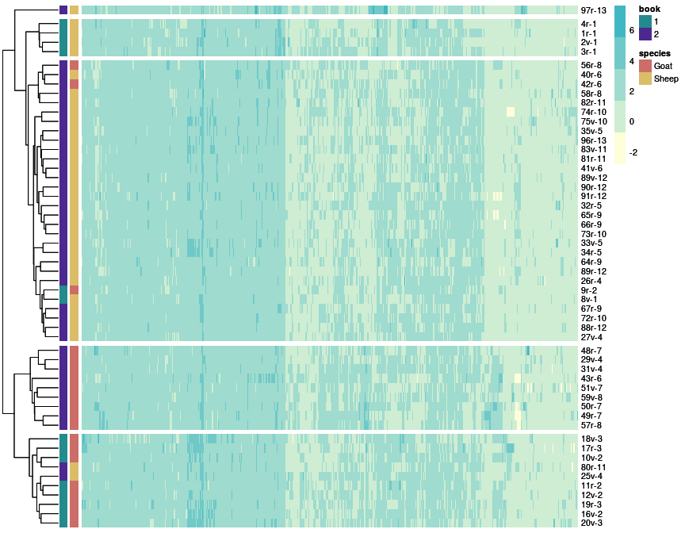
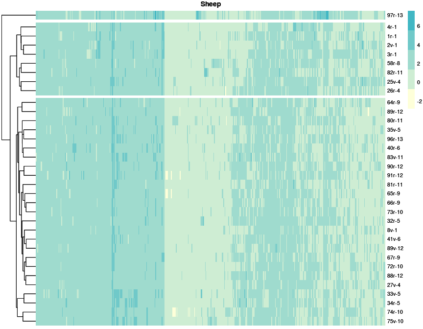
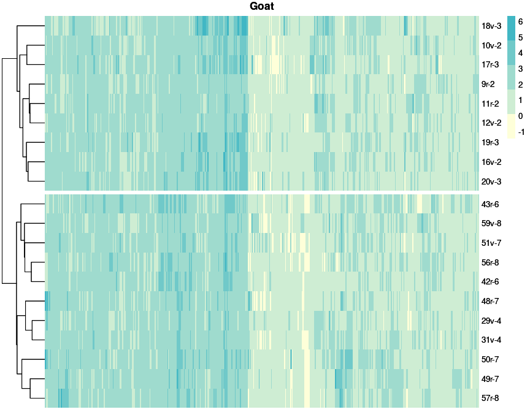

R Notebook
================

``` r
library(MALDIquantForeign)
```

    ## Loading required package: MALDIquant

    ## 
    ## This is MALDIquant version 1.21
    ## Quantitative Analysis of Mass Spectrometry Data
    ##  See '?MALDIquant' for more information about this package.

``` r
library(MALDIquant)
library(tidyverse)
```

    ## ── Attaching packages
    ## ───────────────────────────────────────
    ## tidyverse 1.3.2 ──

    ## ✔ ggplot2 3.3.6      ✔ purrr   0.3.4 
    ## ✔ tibble  3.1.8      ✔ dplyr   1.0.10
    ## ✔ tidyr   1.2.1      ✔ stringr 1.4.1 
    ## ✔ readr   2.1.2      ✔ forcats 0.5.2 
    ## ── Conflicts ────────────────────────────────────────── tidyverse_conflicts() ──
    ## ✖ dplyr::filter() masks stats::filter()
    ## ✖ dplyr::lag()    masks stats::lag()

``` r
library(parallel)
library(cowplot)
library(ggpubr)
```

    ## 
    ## Attaching package: 'ggpubr'
    ## 
    ## The following object is masked from 'package:cowplot':
    ## 
    ##     get_legend

``` r
library(ggrepel)
library(sva)
```

    ## Loading required package: mgcv
    ## Loading required package: nlme
    ## 
    ## Attaching package: 'nlme'
    ## 
    ## The following object is masked from 'package:dplyr':
    ## 
    ##     collapse
    ## 
    ## This is mgcv 1.8-40. For overview type 'help("mgcv-package")'.
    ## Loading required package: genefilter
    ## 
    ## Attaching package: 'genefilter'
    ## 
    ## The following object is masked from 'package:readr':
    ## 
    ##     spec
    ## 
    ## Loading required package: BiocParallel

``` r
library(binda)
```

    ## Loading required package: entropy

``` r
library(sda)
```

    ## Loading required package: corpcor
    ## Loading required package: fdrtool

``` r
library(limma)
library(pheatmap)
library(RColorBrewer)
library(viridis)
```

    ## Loading required package: viridisLite

``` r
library(knitr)
library(ggthemes)
```

    ## 
    ## Attaching package: 'ggthemes'
    ## 
    ## The following object is masked from 'package:cowplot':
    ## 
    ##     theme_map

``` r
library(bacollite)

backup_options = options()
backup_par = par()
```

# Data analysis of the preprocessed MALDI data

We analyse the preprocessed MALDI data in the form of feature matrices,
where the rows are the samples and each column a
feature/mass/peak/peptide; the matrix cells are filled with the
processed intensity values.

``` r
basepath = '~/palaeoproteomics/MALDI/spanish_book'
data_folder = file.path(basepath, 'data')
results_folder = file.path(basepath, 'results')

# -----------------------------------------------------------------------------------------
# Read metadata
uoc_metadata = read.csv(file.path(data_folder,'uoc_metadata.csv'))
uoc_metadata = uoc_metadata %>%
  mutate(group = as.factor(group), book = as.factor(book), side = as.factor(side),
         batch = as.factor(batch)) %>% as_tibble()

# -----------------------------------------------------------------------------------------
# Read feature matrix
snr = 5
featMatrix = read_csv(file.path(data_folder,
                                paste0('featureMatrix_',snr,'.csv')),
                      show_col_types = F) %>%
  as.matrix()
featMatrix[is.na(featMatrix)] = 0

colnames(featMatrix) = as.character(round(as.numeric(colnames(featMatrix)),3))
rownames(featMatrix) = uoc_metadata$sample.name
# Scale
scaledFeatMatrix = apply(featMatrix, 2, function(x) (x)/sqrt(var(x)))
```

## Surrogate variable analysis

First of all we will use the `sva` package to estimate and regress out
the surrogate variables. For this, we will tell the algorithm which are
our variables of interest, *species* and *book* and we will let it
determine unwanted sources of variation, among which we have the batch.

``` r
# Prepare models for SVA analyis
mod = model.matrix(~species+group, data = uoc_metadata)
mod0 = model.matrix(~1, data=uoc_metadata)
# Remove surrogate variables
# sva
n.sv = num.sv(t(scaledFeatMatrix), mod, method='be', B=47)
svobj = sva(t(scaledFeatMatrix), mod, mod0, n.sv=n.sv)
```

    ## Number of significant surrogate variables is:  6 
    ## Iteration (out of 5 ):1  2  3  4  5

``` r
colnames(svobj$sv) = paste0('SV', 1:n.sv)
# Fix data
brSVA = fsva(dbdat=t(scaledFeatMatrix), mod=mod, sv=svobj, newdat=t(scaledFeatMatrix))
brSVA = brSVA$db
```

We can calculate F-test for each of the masses to have a preliminary
idea of whether they have differences in the different species and
books. With the corrected data, we compute adjusted p-values (q-value)
for each mass for whether there’s adifference in the species and quire,
using `mod` as a contrast. The method Bonferroni-Hochberg was used to
adjust the p-value. The masses with q-value below 0.05 are labelled.

``` r
# Add surrogate variables to model and estimate pvalues
modSV = cbind(mod, svobj$sv)
mod0SV = cbind(mod0, svobj$sv)
# Calc fstatistics
pValuesSv = f.pvalue(t(scaledFeatMatrix), modSV, mod0SV)
qValuesSv = sort(p.adjust(pValuesSv, method="BH"))

sv_qval = tibble(mass = as.numeric(names(qValuesSv)), q_val = qValuesSv)
kable(sv_qval %>% filter(q_val < 0.05))
```

|     mass |     q_val |
|---------:|----------:|
| 1504.789 | 0.0000000 |
| 3094.730 | 0.0000112 |
| 1299.684 | 0.0000130 |
| 1503.779 | 0.0000130 |
| 3097.483 | 0.0000167 |
| 3094.494 | 0.0000167 |
| 3095.491 | 0.0000167 |
| 3093.497 | 0.0000620 |
| 1504.283 | 0.0000719 |
| 3096.506 | 0.0000719 |
| 2218.047 | 0.0005017 |
| 3035.504 | 0.0006005 |
| 2216.027 | 0.0006111 |
| 1242.656 | 0.0006392 |
| 1160.594 | 0.0007249 |
| 2216.902 | 0.0007249 |
| 3037.501 | 0.0010270 |
| 3034.827 | 0.0010832 |
| 3033.511 | 0.0012305 |
| 3036.509 | 0.0012305 |
|  861.411 | 0.0026149 |
| 1289.599 | 0.0026149 |
| 1049.515 | 0.0026656 |
| 1436.691 | 0.0081129 |
| 2398.979 | 0.0085498 |
| 3034.505 | 0.0092533 |
| 1717.018 | 0.0144722 |
| 2401.007 | 0.0146263 |
| 1717.843 | 0.0165514 |
| 1048.540 | 0.0195465 |
| 1321.588 | 0.0195465 |
| 2056.087 | 0.0195465 |
| 1443.732 | 0.0207831 |
| 1656.418 | 0.0207831 |
| 1273.645 | 0.0263219 |
| 1477.750 | 0.0264992 |
|  811.391 | 0.0289858 |
| 2369.212 | 0.0310010 |
| 1561.883 | 0.0316629 |
| 1889.900 | 0.0331976 |
| 3102.478 | 0.0343446 |
| 1899.581 | 0.0347950 |
| 3079.501 | 0.0347950 |
| 1241.777 | 0.0379797 |
| 1128.528 | 0.0381789 |
| 1852.899 | 0.0381789 |
| 1277.704 | 0.0384822 |
| 1898.963 | 0.0384822 |
| 2370.220 | 0.0384822 |
| 1612.836 | 0.0389931 |
| 1180.624 | 0.0394954 |
| 1478.754 | 0.0396735 |
| 1444.750 | 0.0406081 |
| 3078.529 | 0.0406081 |
| 1873.569 | 0.0436349 |
| 1900.971 | 0.0436349 |
|  893.474 | 0.0447558 |
|  918.503 | 0.0447558 |
| 1264.690 | 0.0447558 |
| 1090.553 | 0.0456996 |
| 1108.553 | 0.0456996 |
|  886.473 | 0.0464029 |
| 1081.570 | 0.0464029 |
| 1613.845 | 0.0464029 |
| 1718.820 | 0.0464029 |
| 1890.915 | 0.0464029 |
| 1899.964 | 0.0464029 |
| 2019.955 | 0.0464029 |
| 3103.511 | 0.0464029 |
| 2500.192 | 0.0466008 |
| 1437.688 | 0.0480680 |
| 1263.713 | 0.0482569 |
| 2410.737 | 0.0482569 |

``` r
pl = ggplot(sv_qval) +
    geom_point(aes(x=mass, y=-log10(q_val)), size=2, alpha=0.7) +
    geom_hline(yintercept=-log10(0.05), color='red') +
    geom_text_repel(aes(x=mass, y=-log10(q_val), label=ifelse(q_val<0.05, mass, '')),
                    size=3, max.overlaps = ) +
    theme_cowplot() +
    theme(axis.title=element_text(size=12), axis.text=element_text(size=10))
pl
```

    ## Warning: ggrepel: 30 unlabeled data points (too many overlaps). Consider
    ## increasing max.overlaps

<!-- -->

``` r
ggsave('f_stats_pval.png', pl, path = results_folder, bg='white',
       width = 9, height = 6, dpi=100)
```

    ## Warning: ggrepel: 29 unlabeled data points (too many overlaps). Consider
    ## increasing max.overlaps

``` r
ggsave('f_stats_pval.svg', pl, path = results_folder, bg='white',
       width = 9, height = 6, dpi=100)
```

    ## Warning: ggrepel: 29 unlabeled data points (too many overlaps). Consider
    ## increasing max.overlaps

## Data visualization and clustering

We perform a hierarchical clustering on the samples and a PCA.

### Hierarchical cluster

The plot shows the hierarchical cluster using ward.D2 as the grouping
method. The leaf labels show the page, the side (v or r), quire and
species.

``` r
# Hierarchical cluster
h = hclust(dist(t(brSVA)), method='ward.D2')
png(file.path(results_folder,'hier_clust.png'),
    width = 12, height = 6, units = 'in', res = 100)
a = plot(h, labels=paste0(uoc_metadata$folia, uoc_metadata$side, '-', uoc_metadata$group, '-',
                      uoc_metadata$species, collapse = NULL),
     ylab='Distance', xlab='Sample', axes=FALSE, sub='', main='Hierarchical clustering',
     cex=1
    )
dev.off()
```

    ## png 
    ##   2

``` r
svg(file.path(results_folder,'hier_clust.svg'),
    width = 12, height = 6)
a = plot(h, labels=paste0(uoc_metadata$folia, uoc_metadata$side, '-', uoc_metadata$group, '-',
                      uoc_metadata$species, collapse = NULL),
     ylab='Distance', xlab='Sample', axes=FALSE, sub='', main='Hierarchical clustering',
     cex=1
    )
dev.off()
```

    ## png 
    ##   2

``` r
plot(h, labels=paste0(uoc_metadata$folia, uoc_metadata$side, '-', uoc_metadata$group, '-',
                      uoc_metadata$species, collapse = NULL),
     ylab='Distance', xlab='Sample', axes=FALSE, sub='', main='Hierarchical clustering',
     cex=1
    )
```

<!-- -->

### Heatmap

Heatmap including all samples with clustering and showing annotations
for species and book

``` r
annot = uoc_metadata %>%
    column_to_rownames('sample.name') %>%
    as.data.frame() %>%
    select(species, book)
cl = paste0(uoc_metadata$folia, uoc_metadata$side, '-', uoc_metadata$group, collapse = NULL)

ann_colors = list(
    species = c(Goat = "#CC6D68", Sheep = "#DBBD68"), 
    book = c("1" = "#238A8DFF", "2" = "#4B2991")
)
# col2 = colorRampPalette(c("white","#EACDC2", "#B75D69", "#774C80", "#372549", "#1A1423"))
col2 = colorRampPalette(c("#FFFFD9", "#C7E9B4", "#7FCDBB", "#41B6C4"))
col2 = ggthemes_data[["tableau"]][["color-palettes"]][['ordered-sequential']][['Blue-Green Sequential']][['value']]
col2 = colorRampPalette(c('#feffd9', "#41b7c4"))
#flip plot
hm_fl = pheatmap(
  t(brSVA), annotation_row = annot, annotation_colors = ann_colors,
  color=col2(5), treeheight_col = 0, show_colnames = F,
  clustering_method = 'ward.D2', labels_row = cl, cutree_row=5,
  annotation_names_row= F, fontsize = 8, cex=1)
hm_fl
```

<!-- -->

``` r
ggsave('heatmap_flipped.png', hm_fl, path=results_folder, width = 9, height = 7,
       dpi=100, bg='white')
ggsave('heatmap_flipped.svg', hm_fl, path=results_folder, width = 9, height = 7,
       dpi=100, bg='white')
```

### PCA

PCA projection showing principal components 1 and 2 (variance in axis
labels). The numbers inside the point are the quire and color is by
species. We also show the eigenvectors of the masses that discriminate
between sheep and goat and the one that’s common to both species.

``` r
masses = as.numeric(colnames(scaledFeatMatrix))
peptides = c(2883, 3017, 3033, 3077, 3093)

mask1 = masses > peptides[1] & masses < peptides[1]+1
mask2 = masses > peptides[2] & masses < peptides[2]+1
mask3 = masses > peptides[3] & masses < peptides[3]+1
mask4 = masses > peptides[4] & masses < peptides[4]+1
mask5 = masses > peptides[5] & masses < peptides[5]+1


batch_rem_pc = prcomp(t(brSVA))
batch_rem_pc_x = as.data.frame(batch_rem_pc$x)
batch_rem_pc_x = cbind(batch_rem_pc_x, uoc_metadata)
perc_var = round(batch_rem_pc$sdev^2*100/sum(batch_rem_pc$sdev^2), 2)

loadings = batch_rem_pc$rotation[, c(1,2,3)] * batch_rem_pc$sdev[c(1,2,3)]
toppc1_loadings = loadings[order(loadings[,'PC1'], decreasing=T),]
plot_loadings = loadings[mask1| mask2 | mask3 | mask4 | mask5, ] * 10

mass_labels = masses[mask1 | mask2 | mask3 | mask4 | mask5]

# PC1 vs PC2
p1 = ggplot(batch_rem_pc_x) +
  geom_point(mapping = aes (x=PC1, y=PC2, color=species),
             size=6, shape=16, stroke=2) +
  xlab(paste0('PC1. ', perc_var[1], "% variance explained")) +
  ylab(paste0('PC2. ', perc_var[2], "% variance explained")) +
  scale_color_manual(values= c(Goat = "#CC6D68", Sheep = "#DBBD68")) + 
  geom_text(mapping = aes(x=PC1, y=PC2, label=as.character(group)),
            color="white", size=3) +
  theme_cowplot()
p1
```

<!-- -->

``` r
p2 = p1 +
  geom_segment(lineend = "butt", linejoin = "round", arrow = arrow(length = unit(0.1, "inches")),
              mapping=aes(xend=PC1,yend=PC2,x=rep(0,5), y=rep(0,5)),
              data=as.data.frame(plot_loadings)) +
  geom_text_repel(mapping=aes(x=PC1, y=PC2,label=as.character(round(as.numeric(mass),2))),
                 data=as.data.frame(plot_loadings) %>% rownames_to_column('mass'))

p2
```

<!-- -->

``` r
ggsave("pca.png", plot=p1, device="png", dpi=100, path=results_folder,
       bg="white")
```

    ## Saving 7 x 5 in image

``` r
ggsave("pca.svg", plot=p1, device="svg", dpi=100, path=results_folder,
       bg="white")
```

    ## Saving 7 x 5 in image

``` r
ggsave("pca_loads.png", plot=p2, device="png", dpi=100, path=results_folder,
       bg="white")
```

    ## Saving 7 x 5 in image

``` r
ggsave("pca_loads.svg", plot=p2, device="svg", dpi=100, path=results_folder,
       bg="white")
```

    ## Saving 7 x 5 in image

## Separate species

We separate the data by species to produce separate heatmaps and PCA
plots.

``` r
# Separate sheep and goat matrices
mat_sheep = brSVA[, uoc_metadata$species == 'Sheep']
mat_goat = brSVA[, uoc_metadata$species == 'Goat']
#Annotations for sheep and goat
uoc_metadata_sheep = uoc_metadata %>% filter(species == 'Sheep')
uoc_metadata_goat = uoc_metadata %>% filter(species == 'Goat')

annot_sheep = uoc_metadata_sheep %>%
  column_to_rownames('sample.name') %>%
  as.data.frame() %>%
  select(species)
cl_sheep = paste0(uoc_metadata_sheep$folia, uoc_metadata_sheep$side, '-', uoc_metadata_sheep$group, collapse = NULL)

annot_goat = uoc_metadata_goat %>%
  column_to_rownames('sample.name') %>%
  as.data.frame() %>%
  select(species)
cl_goat = paste0(uoc_metadata_goat$folia, uoc_metadata_goat$side, '-', uoc_metadata_goat$group, collapse = NULL)
```

### Heatmap by species

``` r
#Heatmap for sheep

heatmap_sheep = pheatmap(
  t(mat_sheep),color=col2(5), treeheight_col = 0, show_colnames = F,
  clustering_method = 'ward.D2', labels_row = cl_sheep, cutree_row=3,
  fontsize = 8, main="Sheep")
heatmap_sheep
```

<!-- -->

``` r
ggsave("heatmap_sheep.png", plot=heatmap_sheep, device="png", dpi=100,
       path=results_folder, width = 9, height = 7)
ggsave("heatmap_sheep.svg", plot=heatmap_sheep, device="svg", dpi=100,
       path=results_folder, width = 9, height = 7)

#Heatmap for goat

heatmap_goat = pheatmap(
  t(mat_goat), color=col2(5), treeheight_col = 0, show_colnames = F,
  clustering_method = 'ward.D2', labels_row = cl_goat, cutree_row=2,
  main="Goat")
heatmap_goat
```

<!-- -->

``` r
ggsave("heatmap_goat.png", plot=heatmap_goat, device="png", dpi=100,
       path=results_folder, width = 9, height = 7)
ggsave("heatmap_goat.svg", plot=heatmap_goat, device="svg", dpi=100,
       path=results_folder, width = 9, height = 7)
```

### PCA by species

Labeled samples are replicates, i.e. samples taken from different pages
that belong to the same piece of parchment or skin.

``` r
sheep_pca = prcomp(t(mat_sheep))
sheep_pca_x = as.data.frame(sheep_pca$x)
sheep_pca_x = cbind(sheep_pca_x, uoc_metadata_sheep)
sheep_pca_x = sheep_pca_x %>% mutate(
  label = ifelse(folia==89|folia==1|folia==8|folia==97,
                 paste0(folia, side, '-', group, collapse = NULL),
                 ""))

perc_var = round(sheep_pca$sdev^2*100/sum(sheep_pca$sdev^2), 2)

# PC1 vs PC2
sheep_pca_plot = ggplot(sheep_pca_x) +
  geom_point(mapping = aes (x=PC1, y=PC2, color=species),
             size=5, shape=16, stroke=2) +
  xlab(paste0('PC1. ', perc_var[1], "% variance explained")) +
  ylab(paste0('PC2. ', perc_var[2], "% variance explained")) +
  scale_color_manual(values= c(Sheep = "#DBBD68")) + 
  geom_text(mapping = aes(x=PC1, y=PC2, label=as.character(group)),
            color="white", size=3) +
  geom_text_repel(mapping = aes(x=PC1, y=PC2, label=label),
            color="black", size=4) +
  theme_cowplot() +
  ggtitle("Sheep")
sheep_pca_plot
```

<!-- -->

``` r
goat_pca = prcomp(t(mat_goat))
goat_pca_x = as.data.frame(goat_pca$x)
goat_pca_x = cbind(goat_pca_x, uoc_metadata_goat)
goat_pca_x = goat_pca_x %>% mutate(
  label = ifelse(folia==16|folia==9,
                 paste0(folia, side, '-', group, collapse = NULL),
                 ""))
perc_var = round(goat_pca$sdev^2*100/sum(goat_pca$sdev^2), 2)

# PC1 vs PC2
goat_pca_plot = ggplot(goat_pca_x) +
  geom_point(mapping = aes (x=PC1, y=PC2, color=species),
             size=5, shape=16, stroke=2) +
  xlab(paste0('PC1. ', perc_var[1], "% variance explained")) +
  ylab(paste0('PC2. ', perc_var[2], "% variance explained")) +
  scale_color_manual(values= c(Goat = "#CC6D68")) + 
  geom_text(mapping = aes(x=PC1, y=PC2, label=as.character(group)),
            color="white", size=4) +
  geom_text_repel(mapping = aes(x=PC1, y=PC2, label=label),
            color="black", size=4) +
  theme_cowplot() +
  ggtitle("Goat")
goat_pca_plot
```

<!-- -->

``` r
ggsave("pca_sheep.png", plot=sheep_pca_plot, device="png", dpi=100, path=results_folder,
       bg="white")
```

    ## Saving 7 x 5 in image

``` r
ggsave("pca_sheep.svg", plot=sheep_pca_plot, device="svg", dpi=100, path=results_folder,
       bg="white")
```

    ## Saving 7 x 5 in image

``` r
ggsave("pca_goat.png", plot=goat_pca_plot, device="png", dpi=100, path=results_folder,
       bg="white")
```

    ## Saving 7 x 5 in image

``` r
ggsave("pca_goat.svg", plot=goat_pca_plot, device="svg", dpi=100, path=results_folder,
       bg="white")
```

    ## Saving 7 x 5 in image

## Discriminant analysis

Then we use discriminant analysis using binary predictors, implemented
in the package `binda` to detect peptides contributing to differences in
the spectra. This is done on a binary basis, accounting for presence or
absence of masses. We perform the analysis for: 1. The whole dataset,
searching for peptides that are different between species 2. For goat
samples, searching for peptides that are different between the 2 found
clusters above (goat heatmap) 3. For sheep samples, searching for
peptides that are different between the 2 found clusters above (sheep
heatmap). We remove the cluster with a single sample as the method needs
more than 2 samples in a group for the analysis.

For each case we show the top 20 different masses with the t-Score
calculated by `binda`. When the t-Score is positive for a group, it
means the mass is present in in, and it will be negative and absent in
the other.

### Whole dataset, species is the target

``` r
colnames(featMatrix) <-
  round(as.double(colnames(featMatrix)),2)
top_rank = 20

# For species
thresh = optimizeThreshold(X=featMatrix, L=uoc_metadata$species, verbose=FALSE)
binMat = dichotomize(X=featMatrix, thresh)
bindar = binda.ranking(Xtrain=binMat, L=uoc_metadata$species, verbose=FALSE)
png(file.path(results_folder, 'bindar_species.png'),
    width=8, height=9, units='in', res=72)
plot(bindar, top=top_rank, arrow.col="black", ylab="Peaks (m/z)")
dev.off()
```

    ## png 
    ##   2

``` r
plot(bindar, top=top_rank, arrow.col="black", ylab="Peaks (m/z)")
```

<!-- -->

``` r
attr(bindar, 'class') = 'matrix'
bindar_species = as_tibble(bindar, rownames='mass')
```

### Goat samples, book is the target

``` r
# For goat
thresh = optimizeThreshold(X=t(mat_goat), L=uoc_metadata_goat$cluster, verbose=FALSE)
binMat = dichotomize(X=t(mat_goat), thresh)
bindar = binda.ranking(Xtrain=binMat, L=uoc_metadata_goat$cluster, verbose=FALSE)
png(file.path(results_folder, 'bindar_goat.png'),
    width=8, height=9, units='in', res=72)
plot(bindar, top=top_rank, arrow.col="black", ylab="Peaks (m/z)",
     main="Top 20 ranking masses for goat clusters")
dev.off()
```

    ## png 
    ##   2

``` r
plot(bindar, top=top_rank, arrow.col="black", ylab="Peaks (m/z)",
     main="Top 20 ranking masses for goat clusters")
```

<!-- -->

``` r
attr(bindar, 'class') = 'matrix'
bindar_goat = as_tibble(bindar, rownames='mass') %>%
  mutate(mass = as.numeric(mass), score=as.numeric(score),
         t.1=as.numeric(t.1), t.2=as.numeric(t.2)) %>%
  select(-idx)
```

### Sheep samples, book is the target

We need to remove the single from the sheep subset. It is sample UoC24.

``` r
# For sheep
# Remove sample from cluster 3
uoc_metadata_sheep_2 = uoc_metadata_sheep %>% filter(!sample.name=="UoC24")
mat_sheep_2 = mat_sheep[, colnames(mat_sheep) != "UoC24"]

thresh = optimizeThreshold(X=t(mat_sheep_2), L=uoc_metadata_sheep_2$cluster, verbose=FALSE)
binMat = dichotomize(X=t(mat_sheep_2), thresh)
png(file.path(results_folder, 'bindar_sheep.png'),
    width=8, height=9, units='in', res=72)
bindar = binda.ranking(Xtrain=binMat, L=uoc_metadata_sheep_2$cluster, verbose=FALSE)
plot(bindar, top=top_rank, arrow.col="black", ylab="Peaks (m/z)",
     main="Top 20 ranking masses for sheep clusters")
dev.off()
```

    ## png 
    ##   2

``` r
plot(bindar, top=top_rank, arrow.col="black", ylab="Peaks (m/z)",
     main="Top 20 ranking masses for sheep clusters")
```

<!-- -->

``` r
attr(bindar, 'class') = 'matrix'
bindar_sheep = as_tibble(bindar, rownames='mass') %>%
  mutate(mass=as.numeric(mass), score=as.numeric(score),
         t.4=as.numeric(t.4), t.5=as.numeric(t.5)) %>%
  select(-idx)
```

## Find non-collagenous peptides masses

The top 20 masses found different between the different clusters for
each species are searched against a list of theoretical collagen masses
derived from sequence. The idea is to find the masses that don’t match,
as they are potential non-collagenous masses, indicating different
production practises. We do 2 rounds of search: 1. Simple matching. We
first try to match the top 20 masses numerically against the theoretical
collagen masses, using a tolerance of 0.6. 2. Bacollite alignment.The
matching masses cannot yet be assigned to collagen, and thus need a 2nd
round search using bacollite that aligns the theoretical spectra
peptides to the samples.

Generate the theoretical list of peptides from sequence data

``` r
parse_seqs = function(species, chain, id, sequence){
  pseq = parse.seq(sequence, max.missed.cleaves = 1)
  pseq$chain=chain
  pseq$species=species
  pseq
}
# Read sequences
collagen = read_csv(file.path(data_folder, 'collagen_seqs.txt'))
```

    ## Rows: 6 Columns: 4
    ## ── Column specification ────────────────────────────────────────────────────────
    ## Delimiter: ","
    ## chr (4): species, chain, id, sequence
    ## 
    ## ℹ Use `spec()` to retrieve the full column specification for this data.
    ## ℹ Specify the column types or set `show_col_types = FALSE` to quiet this message.

``` r
# Digest sequences
peptides = do.call(mcmapply, c(list('FUN'=parse_seqs, 'mc.cores'=4L,
                                    'SIMPLIFY'=F, 'USE.NAMES'=F),
                               as.list(collagen)))
peptides = do.call(bind_rows, peptides) %>% as_tibble()

# peptides = peptides[peptides$nglut==0,]
peptides = peptides[!duplicated(select(peptides, -species, -seqpos)),] %>%
  select(-species)

top_sheep = bindar_sheep %>% mutate(cluster=ifelse(t.4>0, 4, 5))
top_sheep %>% write_csv(file.path(results_folder, "binda_all_sheep.csv"))
top_sheep = top_sheep[1:top_rank,] %>% arrange(mass) %>%
  write_csv(file.path(results_folder, paste0("binda_top", top_rank,"_sheep.csv")))
top_sheep = top_sheep %>% select(-t.4, -t.5)

top_goat = bindar_goat %>% mutate(cluster=ifelse(t.1>0, 1, 2))
top_goat %>% write_csv(file.path(results_folder, "binda_all_goat.csv"))
top_goat = top_goat[1:top_rank,] %>% arrange(mass) %>%
  write_csv(file.path(results_folder, paste0("binda_top", top_rank,"_goat.csv")))
top_goat = top_goat %>% select(-t.1, -t.2)
```

### First round search

This gives us a initial list of non-matching masses, that we can say
they are non-collagenous, given the high tolerance allowed.

``` r
match_binda = function(top_mass, peptides_masses, tol){
  match.closest(top_mass, peptides_masses, tol)
}
tol = 0.6

goat_idx_match = do.call(c,
  lapply(top_goat$mass,
       match_binda,
       sort(peptides$mass1),
       tol)
)

kable(top_goat[is.na(goat_idx_match),])
```

|     mass |    score | cluster |
|---------:|---------:|--------:|
| 1037.520 | 16.66667 |       2 |
| 1235.648 | 16.66667 |       2 |
| 1387.003 | 16.66667 |       1 |
| 1504.789 | 16.66667 |       2 |
| 2872.352 | 16.00000 |       1 |

``` r
sheep_idx_match = do.call(c,
  lapply(top_sheep$mass,
       match_binda,
       sort(peptides$mass1),
       tol)
)

kable(top_sheep[is.na(sheep_idx_match),])
```

|     mass |    score | cluster |
|---------:|---------:|--------:|
| 1263.713 | 22.34296 |       5 |
| 1264.690 | 21.06661 |       5 |
| 1434.760 | 18.66632 |       5 |
| 1658.779 | 17.07958 |       5 |
| 1717.018 | 18.43977 |       5 |
| 2098.062 | 17.07958 |       5 |
| 2114.071 | 17.07958 |       5 |

Now, from the theoretical peptides, we get the matching ones that will
be subsequently aligned. It doesn’t make sense to try to align the
theoretical peptides that don’t match at this point. We are also
including deamidated or undeamidated versions of the peptides to extend
the search. Sometimes the other version aligns better to the spectra.

``` r
match_seq = function(p, top_binda, tol) {
  idx = do.call(
    c,
    lapply(
      p$mass1,
      function(x, tol){
        match.closest(x, top_binda$mass, tol)
      },
      tol
    )
  )
  if (all(is.na(idx))){
    return(NULL)
  } else {
    return(cbind(p, top_binda[idx,]))
  }
}

tol = 0.6

peptides_split = group_split(peptides, seq, nhyd)

match_sheep = mclapply(peptides_split,
         match_seq,
         top_sheep, tol) %>%
  bind_rows() %>% as_tibble() %>%
  mutate(species="Sheep")


match_goat = mclapply(peptides_split,
         match_seq,
         top_goat, tol) %>%
  bind_rows() %>% as_tibble() %>%
  mutate(species="Goat")
```

Plot mass-errors

``` r
comb_match = bind_rows(match_sheep, match_goat) %>% as_tibble() %>%
  filter(!is.na(mass)) %>% mutate(mass_error = mass1-mass)


ggplot(comb_match) +
  geom_point(aes(x=mass, y=mass_error, color=species))
```

<!-- -->

## Second round search

We align the theoretical peptides that matched in the 1st round against
the top 20 masses using bacollite.

Use bacollite to read-in the spectra

``` r
# Read spectra

read_bacollite = function(sample, folder, fext, repsep="_"){
  froot = paste0(folder, '/', sample)
  spots = paste0(repsep, c(1,2,3))
  s = load.sample(froot, sample, spots, fext)
  s$name = sample
  return(s)
}


bl_unproc = lapply(
  uoc_metadata$sample.name,
  read_bacollite,
  file.path(data_folder, 'UoC_txt'),
  fext='.txt')

names(bl_unproc) = uoc_metadata$sample.name

# Divide species
bl_goat = bl_unproc[uoc_metadata %>% filter(species=="Goat") %>% pull(sample.name)]

bl_sheep = bl_unproc[uoc_metadata %>% filter(species=="Sheep") %>% pull(sample.name)]
```

Functions to align theoretical peptides to samples

``` r
ps_fit = function(x, m, f){
  a = ms_fit(peptides = m, sample = x, laglim=0.6,
                       doplot=F, force=T, gauss = 0.2)
  a = as_tibble(a)
  a$sample_name = x$name
  a
}

corr_pept = function(seq, nhyd, nglut, mass1, seqpos, missed.cleaves, chain,
                     mass, score, cluster, species,
                     bl, laglim, f) {
  m = data.frame(
        seq=seq, nhyd=nhyd, nglut=nglut, mass1=mass1, seqpos=seqpos,
        missed.cleaves=missed.cleaves,  chain=chain, mass=mass,
        score=score, cluster=cluster, species=species
      )
  hit_bac = mclapply(
    bl, ps_fit, m, f, mc.cores = 4
  )
  hit_bac = bind_rows(hit_bac)
  
  cl_bac = corlim_data(hit_bac, fn_laglim = laglim)
  bind_cols(m, cl_bac)
}
```

Align peptides from goat clusters to goat samples

``` r
bac_cor_goat = do.call(
    mapply,
    c(list('FUN'=corr_pept, 'SIMPLIFY'=F, 'USE.NAMES'=F,
           'MoreArgs'=list('bl'=bl_goat, 'laglim'=0.3,
                           'f'=file.path(results_folder, 'bacollite_figs'))),
      as.list(match_goat)))

bac_cor_goat = bind_rows(bac_cor_goat)

bac_cor_goat = bac_cor_goat %>% as_tibble() %>%
  mutate(nglut=as.factor(nglut),
         nhyd=as.factor(nhyd),
         cluster=as.factor(cluster),
         mass = as.factor(mass),
         mass1 = as.factor(round(mass1, 2)))
```

Plot correlation results

``` r
threshold_plot = list(
  ggplot(bac_cor_goat %>% filter(cluster==1)) +
    geom_line(aes(x=cl, y=nh, color=nhyd,
                  group=interaction(nhyd, nglut, sep=' - '))) +
    geom_point(aes(x=cl, y=nh, color=nhyd, shape=nglut,
                   group=interaction(nhyd, nglut, sep=' - '))) +
    facet_wrap(vars(mass), ncol=3) +
    theme(axis.title.x = element_blank()) +
    ylab("# hits") +
    ggtitle('Goat cluster 1'),
  
  ggplot(bac_cor_goat %>% filter(cluster==2)) +
    geom_line(aes(x=cl, y=nh, color=nhyd,
                  group=interaction(nhyd, nglut, sep=' - '))) +
    geom_point(aes(x=cl, y=nh, color=nhyd, shape=nglut,
                   group=interaction(nhyd, nglut, sep=' - '))) +
    facet_wrap(vars(mass), ncol=3) +
    theme(axis.title.x = element_blank()) +
    ylab("# hits") +
    ggtitle('Goat cluster 2'),
  
  ggplot(bac_cor_goat %>% filter(is.na(cluster))) +
    geom_line(aes(x=cl, y=nh, color=nhyd,
                  group=interaction(nhyd, nglut, sep=' - '))) +
    geom_point(aes(x=cl, y=nh, color=nhyd, shape=nglut,
                   group=interaction(nhyd, nglut, sep=' - '))) +
    facet_wrap(vars(mass1), ncol=3) +
    xlab('Cross-correlation threshold') +
    ylab("# hits") +
    ggtitle('Goat extended')
)

pl = ggarrange(plotlist = threshold_plot, nrow = 3,
               heights = c(1, 1.5, 2))
pl
```

<!-- -->

``` r
ggsave('bcl_goat.png', pl, path = results_folder, height = 12, width = 7)
```

``` r
bac_cor_sheep = do.call(
    mapply,
    c(list('FUN'=corr_pept, 'SIMPLIFY'=F, 'USE.NAMES'=F,
           'MoreArgs'=list('bl'=bl_sheep, 'laglim'=0.3,
                           'f'=file.path(results_folder, 'bacollite_figs'))),
      as.list(match_sheep)))

bac_cor_sheep = bind_rows(bac_cor_sheep)

bac_cor_sheep = bac_cor_sheep %>% as_tibble() %>%
  mutate(nglut=as.factor(nglut),
         nhyd=as.factor(nhyd),
         cluster=as.factor(cluster),
         mass = as.factor(mass),
         mass1 = as.factor(round(mass1, 2)))
```

``` r
threshold_plot = list( 
  ggplot(bac_cor_sheep %>% filter(cluster==4)) +
    geom_line(aes(x=cl, y=nh, color=nhyd,
                  group=interaction(nhyd, nglut, sep=' - '))) +
    geom_point(aes(x=cl, y=nh, color=nhyd, shape=nglut,
                   group=interaction(nhyd, nglut, sep=' - '))) +
    facet_wrap(vars(mass), ncol=4) +
    theme(axis.title.x = element_blank()) +
    ylab("# hits") +
    ggtitle('Sheep cluster 4'),
  
  ggplot(bac_cor_sheep %>% filter(cluster==5)) +
    geom_line(aes(x=cl, y=nh, color=nhyd,
                  group=interaction(nhyd, nglut, sep=' - '))) +
    geom_point(aes(x=cl, y=nh, color=nhyd, shape=nglut,
                   group=interaction(nhyd, nglut, sep=' - '))) +
    facet_wrap(vars(mass), ncol=4) +
    theme(axis.title.x = element_blank()) +
    ylab("# hits") +
    ggtitle('Sheep cluster 5'),
  
  ggplot(bac_cor_sheep %>% filter(is.na(cluster))) +
    geom_line(aes(x=cl, y=nh, color=nhyd,
                  group=interaction(nhyd, nglut, sep=' - '))) +
    geom_point(aes(x=cl, y=nh, color=nhyd, shape=nglut,
                   group=interaction(nhyd, nglut, sep=' - '))) +
    facet_wrap(vars(mass1), ncol=4) +
    xlab('Cross-correlation threshold') +
    ylab("# hits") +
    ggtitle('Sheep extended')
)
pl = ggarrange(plotlist = threshold_plot, nrow = 3,
               heights = c(1, 1, 2))
pl
```

<!-- -->

``` r
ggsave('bcl_sheep.png', pl, path = results_folder, height = 12, width = 7)
```

This gives us new masses that even though matched in the 1st round, a
2nd search using bacollite cannot align them to theoretical spectra, or
at least the alignment is ambiguous.

## Statistical testing on each peptide

The statistical methods and tests in this section, used to search for
differential peptides between species or books are not so well
established, tested and benchmarked for MALDI-TOF data. We err on the
side of caution and not included it in the final version of the paper.

We keep the analysis here in this notebook as we see potential in it in
the future, subject to more testing and benchmarking and finer
adaptations to this type of data.

First we build a statistical model for our data that includes the
contribution of the species and the book each sample belongs to.

For sample $i$, and feature peak $j$, the observed intensity signal $y$
is:

$y_{ij} = \alpha_j x_{ij} + \beta_j x_{ij} + \gamma_j x_{ij}$,

where $\alpha_j$ is the species contribution of the peak $j$ and
$\beta_j$ is for the book. The model also accounts for the batch,
through parameter $\gamma$.

In the process we follow the following steps:

1.  Fit model to the data to estimate all the $\alpha_i$ and $\beta_i$
    parameters.
2.  Define the contrasts we are interested in, in this case the
    difference between *sheep* and *goat* and the two books.
3.  Fit the contrasts: perform the statistical testing to the defined
    contrasts and calculate the size and significance of the contrasts.
    Adjust p-values for multiple testing.

The results are summarised in a volcano plot, showing the size and
significance of the differences. Finally we do several diagnostic plots
to determine if the assumptions are fulfilled.

``` r
# Models for peptides testing
LB_Bmod = model.matrix(~0+species+book+batch, data=uoc_metadata)

# fit model on batch corrected data
fit.LBB = lmFit(brSVA, LB_Bmod)

# Create contrasts
LBB.contrast = makeContrasts(
  species_contrast = 'speciesSheep - speciesGoat',
  book_contrast = 'book2',
  levels = LB_Bmod
)
```

### Test and plot

``` r
test.contrasts = function(fit, contr){
  fit2 = contrasts.fit(fit, contr)
  fit2 = eBayes(fit2, robust=T, trend=T)
  return(fit2)
}

diag_plots = function(fit2, base_main){
  par(mfrow=c(3,1))
  # SA Plot: avg vs dispersion
  plotSA(fit2, col=c('black', 'red'), cex=1.5, main='SA plot')
  # MA Plot: avg vs log2FC
  plotMA(fit2, cex=1.5, main='MA plot', status=p.adjust(fit2$F.p.value, method='BH')<0.05,
         value=T, legend=F)
  # p.values distriburtion
  hist(fit2$F.p.value, breaks=20, xlab='p-value',
       main='p-value distribution')
  title(base_main, line=1, outer = T, cex=2)
}

volc_plot = function(fit2, contr, base_main){
  # volcano plot per contrast coef: log2FC vs -log10pval
  # Also return a table with the data
  volcpl = list()
  ctrs = list()
  for (coef_idx in 1:length(colnames(contr))){
    volcdf = data.frame(mass=names(fit2$coefficients[,coef_idx]),
                        logFC = fit2$coeff[,coef_idx],
                        adj.p.val = p.adjust(fit2$p.value[,coef_idx], 'BH'),
                        p.val = fit2$p.value[,coef_idx],
                        stringsAsFactors = F)
    volcdf = volcdf %>%  mutate(l = ifelse(volcdf$adj.p.val <= 0.05, volcdf$mass, ''))
    DEstatus = cut(volcdf$adj.p.val, c(0,0.05,1))
    levels(DEstatus) = c('(0,0.05]','(0.05,1]')
    volcdf$DEstatus = DEstatus
    
    v = ggplot(volcdf, mapping = aes(x=logFC, y=-log10(adj.p.val))) +
      geom_point(mapping = aes(color=DEstatus)) +
      theme_cowplot() +
      ylab("-log10(FDR)") +
      geom_hline(yintercept = -log10(0.05), color='red') +
      scale_color_manual(name='FDR',
                         values=c('(0,0.05]'='#00BFC4','(0.05,1]'='#F8766D'),
                         na.value='grey66',
                         labels=c('FDR<=0.05','FDR>0.05')) +
      geom_text_repel(aes(label=l), color='black', size=3, max.overlaps = 20) +
      ggtitle(colnames(fit2$coeff)[coef_idx])
    
    v = v + theme(legend.position = 'right')

    ctrs[[colnames(fit2$coeff)[coef_idx]]] = volcdf
    volcpl[[coef_idx]] = v 
  }
  pl = ggarrange(plotlist = volcpl, nrow=1, ncol=length(colnames(contr)),
                common.legend = TRUE)
#   table = topTable(fit2, p.value=0.05, number=length(fit2$p.value))
#   table %>% rownames_to_column('mass') %>% write_csv(paste(base_file, '_table.csv', sep=''))
  a = list(ctrs, pl)
  return(a)
}
```

Diagnostic plots.

1.  SA-plot: Plot of variance dispersion (sigma) against average log
    intensity for each peptide. It indicates whether there is
    heteroskedasticity in the data, which happens if variance tends to
    increase (or decrease) with the intensity value
2.  MA-plot: Log-fold change against average log intensity per peptide.
    It indicates whether differences between groups are affected by the
    scale of the intensity values themselves.
3.  Distribution of p-values. It indicates values skewed towards smaller
    values, which would reject the null hypotheses that there are no
    differences.

``` r
# Test contrasts and plot
fit2.LBB = test.contrasts(fit.LBB, LBB.contrast)
diag_plots(fit2.LBB, 'SV corrected data, batch as factor.')
```

<!-- -->

``` r
png(file.path(results_folder, 'model_diag_plots.png'),
    width=8, height=9, units='in', res=100)
diag_plots(fit2.LBB, 'SV corrected data, batch as factor.')
dev.off()
```

    ## png 
    ##   2

Here we present a volcano plot, that shows the scale of the differences
(logFC) between species or books versus the significance of the
difference (-log(FDR)).

``` r
a = volc_plot(fit2.LBB, LBB.contrast,'SV corrected data, batch as factor.')
tables.LBB = a[[1]]
vcpl = a[[2]]
vcpl
```

    ## Warning: ggrepel: 23 unlabeled data points (too many overlaps). Consider
    ## increasing max.overlaps

<!-- -->

``` r
ggsave('volcano_plot.png', vcpl, path = results_folder, dpi=100, bg="white")
```

    ## Saving 11 x 7 in image

    ## Warning: ggrepel: 22 unlabeled data points (too many overlaps). Consider
    ## increasing max.overlaps

``` r
species.table = tables.LBB$species_contrast
book.table = tables.LBB$book_contrast

species_peps = species.table %>%
  filter(adj.p.val<=0.05) %>%
  arrange(adj.p.val) %>%
  dplyr::pull(mass) %>%
  as.numeric()
kable(
  species.table %>%
    filter(adj.p.val<=0.05) %>%
    arrange(adj.p.val) %>%
    dplyr::select(-DEstatus)
)
```

|          | mass     |      logFC | adj.p.val |     p.val | l        |
|:---------|:---------|-----------:|----------:|----------:|:---------|
| 3094.73  | 3094.73  | -1.7880406 | 0.0000000 | 0.0000000 | 3094.73  |
| 1299.684 | 1299.684 | -1.8845618 | 0.0000000 | 0.0000000 | 1299.684 |
| 3094.494 | 3094.494 | -1.7399867 | 0.0000000 | 0.0000000 | 3094.494 |
| 3095.491 | 3095.491 | -1.7230092 | 0.0000000 | 0.0000000 | 3095.491 |
| 3097.483 | 3097.483 | -1.7402656 | 0.0000000 | 0.0000000 | 3097.483 |
| 3093.497 | 3093.497 | -1.6661906 | 0.0000000 | 0.0000000 | 3093.497 |
| 3096.506 | 3096.506 | -1.6734690 | 0.0000000 | 0.0000000 | 3096.506 |
| 2216.027 | 2216.027 | -1.6231064 | 0.0000000 | 0.0000000 | 2216.027 |
| 2218.047 | 2218.047 | -1.5760215 | 0.0000000 | 0.0000000 | 2218.047 |
| 1503.779 | 1503.779 | -1.7503108 | 0.0000000 | 0.0000000 | 1503.779 |
| 1504.789 | 1504.789 | -1.7925587 | 0.0000000 | 0.0000000 | 1504.789 |
| 2216.902 | 2216.902 | -1.5887248 | 0.0000000 | 0.0000000 | 2216.902 |
| 3034.827 | 3034.827 |  1.4782403 | 0.0000000 | 0.0000000 | 3034.827 |
| 3034.505 | 3034.505 |  1.2749234 | 0.0000000 | 0.0000000 | 3034.505 |
| 3033.511 | 3033.511 |  1.3639029 | 0.0000000 | 0.0000000 | 3033.511 |
| 3037.501 | 3037.501 |  1.3834657 | 0.0000000 | 0.0000000 | 3037.501 |
| 3035.504 | 3035.504 |  1.3593521 | 0.0000000 | 0.0000000 | 3035.504 |
| 2219.019 | 2219.019 | -1.4081291 | 0.0000000 | 0.0000000 | 2219.019 |
| 3036.509 | 3036.509 |  1.3539126 | 0.0000001 | 0.0000000 | 3036.509 |
| 3102.478 | 3102.478 | -1.0357385 | 0.0000001 | 0.0000000 | 3102.478 |
| 1504.283 | 1504.283 | -1.4860261 | 0.0000004 | 0.0000000 | 1504.283 |
| 3079.501 | 3079.501 | -1.3148409 | 0.0000012 | 0.0000001 | 3079.501 |
| 3079.166 | 3079.166 | -1.2725176 | 0.0000014 | 0.0000001 | 3079.166 |
| 3103.511 | 3103.511 | -0.9879241 | 0.0000017 | 0.0000001 | 3103.511 |
| 835.418  | 835.418  | -1.1236063 | 0.0000068 | 0.0000003 | 835.418  |
| 2690.215 | 2690.215 | -0.6901516 | 0.0000070 | 0.0000004 | 2690.215 |
| 3078.529 | 3078.529 | -1.1722438 | 0.0000103 | 0.0000006 | 3078.529 |
| 3080.583 | 3080.583 | -1.2191280 | 0.0000115 | 0.0000007 | 3080.583 |
| 3101.472 | 3101.472 | -0.9116950 | 0.0000308 | 0.0000018 | 3101.472 |
| 1160.594 | 1160.594 |  0.9113917 | 0.0000601 | 0.0000036 | 1160.594 |
| 1694.846 | 1694.846 | -0.6209348 | 0.0000617 | 0.0000039 | 1694.846 |
| 2401.007 | 2401.007 | -0.9515394 | 0.0000636 | 0.0000041 | 2401.007 |
| 3085.771 | 3085.771 | -0.9270678 | 0.0000993 | 0.0000066 | 3085.771 |
| 882.392  | 882.392  | -1.1083333 | 0.0001111 | 0.0000076 | 882.392  |
| 1300.561 | 1300.561 | -0.5878367 | 0.0001608 | 0.0000114 | 1300.561 |
| 3077.41  | 3077.41  | -1.0049025 | 0.0001739 | 0.0000127 | 3077.41  |
| 3081.502 | 3081.502 | -1.0848716 | 0.0002338 | 0.0000175 | 3081.502 |
| 2398.979 | 2398.979 | -0.8306387 | 0.0003362 | 0.0000259 | 2398.979 |
| 1158.023 | 1158.023 |  0.7690169 | 0.0003620 | 0.0000286 | 1158.023 |
| 3044.978 | 3044.978 | -0.7556321 | 0.0005966 | 0.0000483 | 3044.978 |
| 1065.564 | 1065.564 | -0.6207303 | 0.0006799 | 0.0000564 | 1065.564 |
| 1064.586 | 1064.586 | -0.6110788 | 0.0008425 | 0.0000733 | 1064.586 |
| 2031.035 | 2031.035 | -0.4753150 | 0.0008425 | 0.0000720 | 2031.035 |
| 1242.656 | 1242.656 | -0.8537877 | 0.0008893 | 0.0000792 | 1242.656 |
| 1321.588 | 1321.588 | -0.6853463 | 0.0010809 | 0.0000985 | 1321.588 |
| 2689.24  | 2689.24  | -0.5396811 | 0.0015118 | 0.0001438 | 2689.24  |
| 2691.246 | 2691.246 | -0.5690113 | 0.0015118 | 0.0001436 | 2691.246 |
| 3019.416 | 3019.416 |  0.4455862 | 0.0016214 | 0.0001575 | 3019.416 |
| 945.471  | 945.471  | -0.7140721 | 0.0020558 | 0.0002122 | 945.471  |
| 1081.57  | 1081.57  | -0.4708079 | 0.0020558 | 0.0002080 | 1081.57  |
| 2400.363 | 2400.363 | -0.7627040 | 0.0020558 | 0.0002090 | 2400.363 |
| 2042.12  | 2042.12  | -0.4573798 | 0.0029136 | 0.0003067 | 2042.12  |
| 883.445  | 883.445  | -0.8356111 | 0.0029547 | 0.0003170 | 883.445  |
| 1849.908 | 1849.908 |  0.7887636 | 0.0036459 | 0.0003985 | 1849.908 |
| 1792.735 | 1792.735 |  0.4281006 | 0.0039470 | 0.0004394 | 1792.735 |
| 1613.845 | 1613.845 | -0.8082713 | 0.0059983 | 0.0006800 | 1613.845 |
| 3117.462 | 3117.462 |  0.5216836 | 0.0066354 | 0.0007656 | 3117.462 |
| 2028.029 | 2028.029 | -0.3492650 | 0.0070372 | 0.0008262 | 2028.029 |
| 1300.41  | 1300.41  | -0.6814397 | 0.0080965 | 0.0009670 | 1300.41  |
| 1961.051 | 1961.051 | -0.3626400 | 0.0086166 | 0.0010465 | 1961.051 |
| 1064.951 | 1064.951 | -0.6341202 | 0.0091761 | 0.0011331 | 1064.951 |
| 2498.204 | 2498.204 |  0.4058617 | 0.0091779 | 0.0011519 | 2498.204 |
| 1079.559 | 1079.559 | -0.5066413 | 0.0104046 | 0.0013269 | 1079.559 |
| 3930.035 | 3930.035 |  0.5779698 | 0.0116363 | 0.0015075 | 3930.035 |
| 1717.843 | 1717.843 |  0.4913114 | 0.0126876 | 0.0016694 | 1717.843 |
| 1320.433 | 1320.433 | -0.7916579 | 0.0138241 | 0.0018764 | 1320.433 |
| 1873.569 | 1873.569 | -0.6937509 | 0.0138241 | 0.0019029 | 1873.569 |
| 3101.258 | 3101.258 | -0.7261344 | 0.0138241 | 0.0018809 | 3101.258 |
| 2029.033 | 2029.033 | -0.3071531 | 0.0156465 | 0.0021854 | 2029.033 |
| 1976.971 | 1976.971 | -0.2788098 | 0.0195374 | 0.0027685 | 1976.971 |
| 2692.194 | 2692.194 | -0.4562537 | 0.0197905 | 0.0028444 | 2692.194 |
| 1693.85  | 1693.85  | -0.3564306 | 0.0198995 | 0.0029003 | 1693.85  |
| 1273.645 | 1273.645 |  0.7606993 | 0.0200468 | 0.0029624 | 1273.645 |
| 811.391  | 811.391  | -0.7066507 | 0.0200823 | 0.0030083 | 811.391  |
| 1614.835 | 1614.835 | -0.7817609 | 0.0201437 | 0.0030990 | 1614.835 |
| 1694.087 | 1694.087 | -0.5572740 | 0.0201437 | 0.0030663 | 1694.087 |
| 836.421  | 836.421  | -0.3270782 | 0.0211005 | 0.0032889 | 836.421  |
| 1718.82  | 1718.82  |  0.4585677 | 0.0213919 | 0.0033777 | 1718.82  |
| 874.402  | 874.402  | -0.4385049 | 0.0239826 | 0.0038353 | 874.402  |
| 936.42   | 936.42   | -0.3388560 | 0.0244969 | 0.0039671 | 936.42   |
| 890.372  | 890.372  | -0.4618226 | 0.0292402 | 0.0047944 | 890.372  |
| 3118.279 | 3118.279 |  0.5907881 | 0.0303517 | 0.0050381 | 3118.279 |
| 3017.35  | 3017.35  |  0.5078988 | 0.0316528 | 0.0053182 | 3017.35  |
| 1166.582 | 1166.582 |  0.3294205 | 0.0319643 | 0.0054352 | 1166.582 |
| 1144.527 | 1144.527 | -0.3347276 | 0.0325543 | 0.0056014 | 1144.527 |
| 1241.777 | 1241.777 | -0.6439666 | 0.0336711 | 0.0058618 | 1241.777 |
| 3993.107 | 3993.107 | -0.4560819 | 0.0363460 | 0.0064010 | 3993.107 |
| 2043.999 | 2043.999 | -0.3221548 | 0.0381208 | 0.0067908 | 2043.999 |
| 2499.672 | 2499.672 |  0.5328897 | 0.0488820 | 0.0088067 | 2499.672 |

``` r
book_peps = book.table %>%
  filter(adj.p.val<=0.05) %>%
  arrange(adj.p.val) %>%
  dplyr::pull(mass) %>%
  as.numeric()
kable(
  book.table %>%
    filter(adj.p.val<=0.05) %>%
    arrange(adj.p.val) %>%
    dplyr::select(-DEstatus)
)
```

|          | mass     |      logFC | adj.p.val |     p.val | l        |
|:---------|:---------|-----------:|----------:|----------:|:---------|
| 1899.964 | 1899.964 | -1.8098845 | 0.0000047 | 0.0000000 | 1899.964 |
| 1599.761 | 1599.761 |  1.0062845 | 0.0000702 | 0.0000003 | 1599.761 |
| 1160.594 | 1160.594 | -1.4357243 | 0.0000989 | 0.0000006 | 1160.594 |
| 1898.963 | 1898.963 | -1.3180531 | 0.0003003 | 0.0000030 | 1898.963 |
| 1899.581 | 1899.581 | -1.5632038 | 0.0003003 | 0.0000027 | 1899.581 |
| 1600.768 | 1600.768 |  0.8067872 | 0.0008051 | 0.0000098 | 1600.768 |
| 1900.971 | 1900.971 | -1.3455584 | 0.0009555 | 0.0000135 | 1900.971 |
| 1658.779 | 1658.779 |  0.9871305 | 0.0027113 | 0.0000439 | 1658.779 |
| 1718.82  | 1718.82  |  0.9466300 | 0.0027223 | 0.0000496 | 1718.82  |
| 2169.035 | 2169.035 |  0.6970431 | 0.0036313 | 0.0000735 | 2169.035 |
| 1242.656 | 1242.656 | -1.1677324 | 0.0070182 | 0.0001575 | 1242.656 |
| 2114.071 | 2114.071 |  0.8833177 | 0.0070182 | 0.0001705 | 2114.071 |
| 2098.062 | 2098.062 |  0.9258937 | 0.0079567 | 0.0002238 | 2098.062 |
| 3020.434 | 3020.434 | -0.7956093 | 0.0079567 | 0.0002255 | 3020.434 |
| 3063.033 | 3063.033 | -0.9762971 | 0.0085711 | 0.0002603 | 3063.033 |
| 1434.76  | 1434.76  |  0.7737678 | 0.0090699 | 0.0002938 | 1434.76  |
| 1923.283 | 1923.283 | -0.8252237 | 0.0111568 | 0.0003839 | 1923.283 |
| 1241.777 | 1241.777 | -1.2122453 | 0.0114737 | 0.0004181 | 1241.777 |
| 1601.776 | 1601.776 |  0.8062158 | 0.0123167 | 0.0004737 | 1601.776 |
| 2099.027 | 2099.027 |  0.8548289 | 0.0131026 | 0.0005305 | 2099.027 |
| 1598.751 | 1598.751 |  0.7905670 | 0.0132766 | 0.0005644 | 1598.751 |
| 1107.565 | 1107.565 | -0.6333596 | 0.0137209 | 0.0006111 | 1107.565 |
| 1201.727 | 1201.727 |  0.8723433 | 0.0173999 | 0.0008101 | 1201.727 |
| 1384.699 | 1384.699 |  0.8929500 | 0.0176957 | 0.0008597 | 1384.699 |
| 1717.843 | 1717.843 |  0.7265562 | 0.0247574 | 0.0012529 | 1717.843 |
| 952.447  | 952.447  | -0.4651862 | 0.0262425 | 0.0013812 | 952.447  |
| 2115.024 | 2115.024 |  0.8223020 | 0.0265194 | 0.0014494 | 2115.024 |
| 811.391  | 811.391  | -1.0858489 | 0.0267821 | 0.0016040 | 811.391  |
| 861.411  | 861.411  | -1.2074444 | 0.0267821 | 0.0016296 | 861.411  |
| 1600.475 | 1600.475 |  0.7704573 | 0.0267821 | 0.0016502 | 1600.475 |
| 2056.977 | 2056.977 |  0.5540619 | 0.0267821 | 0.0016807 | 2056.977 |
| 1717.018 | 1717.018 |  0.8372516 | 0.0304111 | 0.0019700 | 1717.018 |
| 2100.068 | 2100.068 |  0.7261801 | 0.0313768 | 0.0021595 | 2100.068 |
| 3119.467 | 3119.467 | -0.7716841 | 0.0313768 | 0.0021065 | 3119.467 |
| 3117.462 | 3117.462 | -0.6729688 | 0.0324140 | 0.0022965 | 3117.462 |
| 953.445  | 953.445  | -0.5839689 | 0.0330924 | 0.0024410 | 953.445  |
| 2500.192 | 2500.192 | -0.4920162 | 0.0330924 | 0.0024786 | 2500.192 |
| 2057.965 | 2057.965 |  0.4253666 | 0.0374860 | 0.0028835 | 2057.965 |
| 1672.861 | 1672.861 | -1.0679028 | 0.0414476 | 0.0032722 | 1672.861 |
| 1234.867 | 1234.867 |  0.5195957 | 0.0425759 | 0.0034474 | 1234.867 |
| 1922.914 | 1922.914 | -0.5414446 | 0.0441275 | 0.0036624 | 1922.914 |
| 1236.618 | 1236.618 |  0.5788982 | 0.0454897 | 0.0038675 | 1236.618 |
| 1106.568 | 1106.568 | -0.4835637 | 0.0481922 | 0.0041949 | 1106.568 |

``` r
sessionInfo()
```

    ## R version 4.2.1 (2022-06-23)
    ## Platform: x86_64-pc-linux-gnu (64-bit)
    ## Running under: Ubuntu 18.04.6 LTS
    ## 
    ## Matrix products: default
    ## BLAS:   /usr/lib/x86_64-linux-gnu/blas/libblas.so.3.7.1
    ## LAPACK: /usr/lib/x86_64-linux-gnu/lapack/liblapack.so.3.7.1
    ## 
    ## locale:
    ##  [1] LC_CTYPE=en_US.UTF-8       LC_NUMERIC=C              
    ##  [3] LC_TIME=en_GB.UTF-8        LC_COLLATE=en_US.UTF-8    
    ##  [5] LC_MONETARY=en_GB.UTF-8    LC_MESSAGES=en_US.UTF-8   
    ##  [7] LC_PAPER=en_GB.UTF-8       LC_NAME=C                 
    ##  [9] LC_ADDRESS=C               LC_TELEPHONE=C            
    ## [11] LC_MEASUREMENT=en_GB.UTF-8 LC_IDENTIFICATION=C       
    ## 
    ## attached base packages:
    ## [1] parallel  stats     graphics  grDevices utils     datasets  methods  
    ## [8] base     
    ## 
    ## other attached packages:
    ##  [1] bacollite_1.0.1        ggthemes_4.2.4         knitr_1.40            
    ##  [4] viridis_0.6.2          viridisLite_0.4.1      RColorBrewer_1.1-3    
    ##  [7] pheatmap_1.0.12        limma_3.52.1           sda_1.3.8             
    ## [10] fdrtool_1.2.17         corpcor_1.6.10         binda_1.0.4           
    ## [13] entropy_1.3.1          sva_3.44.0             BiocParallel_1.30.3   
    ## [16] genefilter_1.78.0      mgcv_1.8-40            nlme_3.1-159          
    ## [19] ggrepel_0.9.1          ggpubr_0.4.0           cowplot_1.1.1         
    ## [22] forcats_0.5.2          stringr_1.4.1          dplyr_1.0.10          
    ## [25] purrr_0.3.4            readr_2.1.2            tidyr_1.2.1           
    ## [28] tibble_3.1.8           ggplot2_3.3.6          tidyverse_1.3.2       
    ## [31] MALDIquantForeign_0.13 MALDIquant_1.21       
    ## 
    ## loaded via a namespace (and not attached):
    ##   [1] googledrive_2.0.0        colorspace_2.0-3         ggsignif_0.6.3          
    ##   [4] ellipsis_0.3.2           XVector_0.36.0           base64enc_0.1-3         
    ##   [7] fs_1.5.2                 rstudioapi_0.14          farver_2.1.1            
    ##  [10] bit64_4.0.5              AnnotationDbi_1.58.0     fansi_1.0.3             
    ##  [13] lubridate_1.8.0          xml2_1.3.3               codetools_0.2-18        
    ##  [16] splines_4.2.1            cachem_1.0.6             jsonlite_1.8.0          
    ##  [19] broom_1.0.1              annotate_1.74.0          dbplyr_2.2.1            
    ##  [22] png_0.1-7                compiler_4.2.1           httr_1.4.4              
    ##  [25] backports_1.4.1          assertthat_0.2.1         Matrix_1.5-0            
    ##  [28] fastmap_1.1.0            gargle_1.2.0             cli_3.4.0               
    ##  [31] htmltools_0.5.3          tools_4.2.1              gtable_0.3.1            
    ##  [34] glue_1.6.2               GenomeInfoDbData_1.2.8   Rcpp_1.0.9              
    ##  [37] carData_3.0-5            Biobase_2.56.0           cellranger_1.1.0        
    ##  [40] vctrs_0.4.1              Biostrings_2.64.0        svglite_2.1.0           
    ##  [43] xfun_0.33                rvest_1.0.3              lifecycle_1.0.2         
    ##  [46] statmod_1.4.37           rstatix_0.7.0            XML_3.99-0.10           
    ##  [49] googlesheets4_1.0.1      edgeR_3.38.1             zlibbioc_1.42.0         
    ##  [52] scales_1.2.1             vroom_1.5.7              ragg_1.2.2              
    ##  [55] hms_1.1.2                yaml_2.3.5               gridExtra_2.3           
    ##  [58] memoise_2.0.1            stringi_1.7.8            RSQLite_2.2.16          
    ##  [61] highr_0.9                S4Vectors_0.34.0         readBrukerFlexData_1.9.0
    ##  [64] BiocGenerics_0.42.0      readMzXmlData_2.8.1      GenomeInfoDb_1.32.2     
    ##  [67] systemfonts_1.0.4        rlang_1.0.5              pkgconfig_2.0.3         
    ##  [70] bitops_1.0-7             matrixStats_0.62.0       evaluate_0.16           
    ##  [73] lattice_0.20-45          labeling_0.4.2           bit_4.0.4               
    ##  [76] tidyselect_1.1.2         magrittr_2.0.3           R6_2.5.1                
    ##  [79] IRanges_2.30.0           generics_0.1.3           DBI_1.1.3               
    ##  [82] pillar_1.8.1             haven_2.5.1              withr_2.5.0             
    ##  [85] survival_3.4-0           KEGGREST_1.36.2          abind_1.4-5             
    ##  [88] RCurl_1.98-1.8           modelr_0.1.9             crayon_1.5.1            
    ##  [91] car_3.1-0                utf8_1.2.2               tzdb_0.3.0              
    ##  [94] rmarkdown_2.16           locfit_1.5-9.6           grid_4.2.1              
    ##  [97] readxl_1.4.1             blob_1.2.3               reprex_2.0.2            
    ## [100] digest_0.6.29            xtable_1.8-4             textshaping_0.3.6       
    ## [103] stats4_4.2.1             munsell_0.5.0
