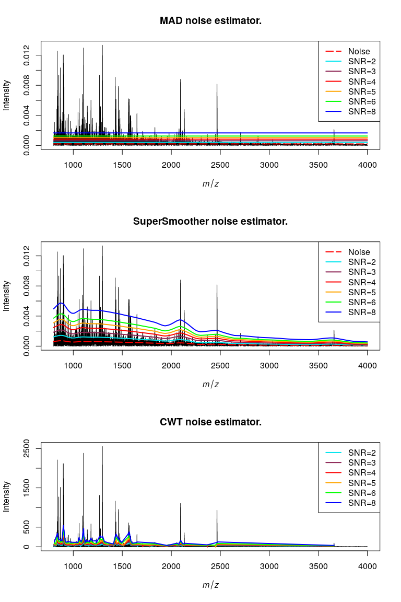
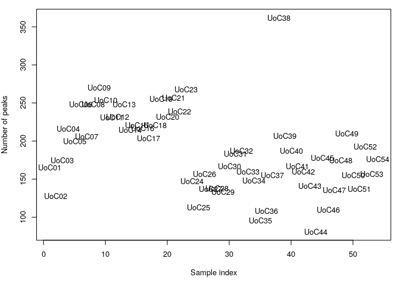

R Notebook
================

``` r
library(MALDIquant)
```

    ## 
    ## This is MALDIquant version 1.21
    ## Quantitative Analysis of Mass Spectrometry Data
    ##  See '?MALDIquant' for more information about this package.

``` r
library(MALDIquantForeign)
library(MALDIrppa)
```

    ## Loading required package: signal

    ## 
    ## Attaching package: 'signal'

    ## The following objects are masked from 'package:stats':
    ## 
    ##     filter, poly

    ## Loading required package: robustbase

    ## Loading required package: lattice

    ## Loading required package: waveslim

    ## 
    ## waveslim: Wavelet Method for 1/2/3D Signals (version = 1.8.4)

``` r
library(tidyverse)
```

    ## ── Attaching packages
    ## ───────────────────────────────────────
    ## tidyverse 1.3.2 ──

    ## ✔ ggplot2 3.3.6      ✔ purrr   0.3.4 
    ## ✔ tibble  3.1.8      ✔ dplyr   1.0.10
    ## ✔ tidyr   1.2.1      ✔ stringr 1.4.1 
    ## ✔ readr   2.1.2      ✔ forcats 0.5.2 
    ## ── Conflicts ────────────────────────────────────────── tidyverse_conflicts() ──
    ## ✖ dplyr::filter() masks signal::filter(), stats::filter()
    ## ✖ dplyr::lag()    masks stats::lag()

``` r
library(parallel)
library(ggpubr)
library(ggrepel)
library(MassSpecWavelet)
library(MALDIpqi)
```

``` r
# Set data and results folders
basepath = '~/palaeoproteomics/MALDI/spanish_book'
data_folder = file.path(basepath, 'data')
results_folder = file.path(basepath, 'results')
# Set parameters
int_threshold = 50
hws = 20
tolerance = 0.002
iterations = 100
thScale = 2.5
n_procs = 6L
minFreq = 0.6
```

``` r
# Read metadata and data
uoc_metadata = read.csv(file.path(data_folder,'uoc_metadata.csv'), stringsAsFactors=F)
uoc_metadata$sample.name = as.character(uoc_metadata$sample.name)
uoc_data = importMzMl(file.path(data_folder, 'UoC_mzml'), mc.cores=1)

spectra = c()
sample_fac = c()
label_fac = c()
batch_fac = c()
for(i in 1:dim(uoc_metadata)[1]){
  n = uoc_metadata$replicates[i]
  s = uoc_metadata$sample.name[i]
  sp = uoc_metadata$species[i]
  b = uoc_metadata$batch[i]
  spectra = c(spectra, paste0(s, '_', seq(1, n)))
  sample_fac = c(sample_fac, rep(s, n))
  label_fac = c(label_fac, rep(sp, n))
  batch_fac = c(batch_fac, rep(b, n))
}
spectra_metadata = data.frame(
  'spectra'=as.character(spectra),
  'sample'=as.factor(sample_fac),
  'label'=as.factor(label_fac),
  'batch'=as.factor(batch_fac)
)
spectra_metadata$idx = seq(1,nrow(spectra_metadata))

# Include sample metadata
uoc_data = mapply(
  function(x, val, slot){
    metaData(x)[[slot]] = as.character(val)
    return(x)
  },
  uoc_data, spectra_metadata$sample,
  MoreArgs = list(slot='sampleName')
)
names(uoc_data) = spectra_metadata$spectra
```

## Spectra QC screening

We use MALDIrppa screening function and plot the spectra that are
labeled as outliers

``` r
# Initial screening
sc.results = screenSpectra(uoc_data)
```

    ## The default of 'doScale' is FALSE now for stability;
    ##   set options(mc_doScale_quiet=TRUE) to suppress this (once per session) message

``` r
rownames(sc.results$est.table) = spectra_metadata$spectra
plot(sc.results, labels=T)
```

<!-- -->

``` r
qc_control = as_tibble(sc.results$est.table)
failure = qc_control %>% filter(Class == "failure") %>% pull(ID)

f_spec = lapply(failure,
       function(i){
         x = as_tibble(as.matrix(uoc_data[[i]]))
         x$spectra = i
         x
       })
names(f_spec) = failure
f_spec = as_tibble(bind_rows(f_spec))

p = ggplot(f_spec) +
  geom_line(aes(x=mass, y=intensity)) +
  facet_wrap(vars(spectra), scales = "free_y")
p
```

<!-- -->

``` r
ggsave('qc_spectra.png', p, path=results_folder, width = 9, height = 6)
```

## Initial preprocessing of the spectra

The initial preprocessing consists of:

1.  Squared root intensity transformation.

2.  Undecimated wavelet transform smoothing. `wavSmoothing` function on
    `MALDIrppa` package

3.  Baseline correction

4.  Probabilistic Quotient Normalization.

``` r
preprocessing = function(x, iters, thScale){
  
  # Intensity transformation
  x = transformIntensity(x, 'sqrt')
  
  # Smoothing
  # x = smoothIntensity(x, method = 'SavitzkyGolay',
  #                     halfWindowSize = hws)
  
  x = unlist(wavSmoothing(list(x), thresh.scale = thScale))
  
  # Base line correction
  x = removeBaseline(x, method='SNIP', iterations=iters)
  
  # Normalization
  x = calibrateIntensity(x, method="PQN") # or TIC
  
  return(x)
  
}
```

``` r
# Preprocess
preprocessed_l = mclapply(uoc_data, preprocessing, iterations, thScale,
                           mc.cores=n_procs)
preprocessed_l = unlist(preprocessed_l)
```

## Noise estimation and testing

We test 3 different algorithms to estimate noise and detect peaks

1.  Median absolute deviation (MAD).

2.  SuperSmoother.

3.  Continuous Wavelet Transofrm (CWT). This method works on the raw
    spectra without any preprocessing.

We test signal-to-noise ratios (SNR) thresholds: 2, 3, 4, 5, 6, 8. on a
random sample

``` r
snr_values = c(2, 3, 4, 5, 6, 8)

spectra_index = 100
spectra_test = preprocessed_l[[spectra_index]]
unproc_spectra_test = uoc_data[[spectra_index]]
snr_colors= c('turquoise2', 'violetred4', 'red', 'orange', 'green', 'blue')
```

``` r
custom_peakDetectionCWT = function(s, SNR.Th = 2, nearbyPeak = T){
  majorPeakInfo = peakDetectionCWT(s@intensity, SNR.Th = SNR.Th, nearbyPeak = nearbyPeak)$majorPeakInfo
  tunnedPeakInfo = tuneInPeakInfo(s@intensity, majorPeakInfo)
  # Filter masses and intensities with the peakIndex
  p = createMassPeaks(mass=s@mass[tunnedPeakInfo$peakIndex],
                      intensity=s@intensity[tunnedPeakInfo$peakIndex],
                      snr=majorPeakInfo$peakSNR[names(tunnedPeakInfo$peakIndex)])
  return(p)
}


listPeakDetectionCWT = function(sl, ...){
  mclapply(
    sl,
    custom_peakDetectionCWT,
    ...
  )
}


get_peaks = function(sl, detectionMethod='SuperSmoother', ...){
  # args in ... SNR, halfWindowSize, mc.cores
  args = list(...)
  if (is.null(args$mc.cores)){
    args$mc.cores=1
  }
  if (detectionMethod %in% c('MAD', 'SuperSmoother')){
    pl = do.call(detectPeaks, c(list(object=sl, method=detectionMethod), args))
  } else if (detectionMethod=='CWT'){
    pl = listPeakDetectionCWT(sl, SNR.Th=args$SNR, mc.cores=args$mc.cores)
  }
  return(pl)
}

plot_noise = function(s, methods, SNRvalues, colors, nps=NULL){
  par(mfrow=c(length(methods),1), cex=1)
  for (m in methods){
    if (m != 'CWT'){
      noise = estimateNoise(spectra_test, method=m)
      plot(
        s, main = paste0(m, " noise estimator."), sub=NULL,
        xlim=c(min(s@mass), max(s@mass)), ylim=c(0, max(s@intensity))
      )
      legend(x='topright', legend=c('Noise', paste0('SNR=', SNRvalues)),
             col=c('red', colors), lty=c(5, rep(1,length(SNRvalues))), lwd=rep(2,length(SNRvalues)+1))
      lines(noise, col="red", lwd=2, lty=5)
    } else if (m == 'CWT' & !is.null(nps)) {
      plot(
        nps, main = paste0(m, " noise estimator."), sub=NULL,
        xlim=c(min(nps@mass), max(nps@mass)), ylim=c(0, max(nps@intensity))
      )
      legend(x='topright', legend=c(paste0('SNR=', SNRvalues)),
             col=c(colors), lty=rep(1,length(SNRvalues)), lwd=rep(2,length(SNRvalues)))
    }
    for (i in 1:length(SNRvalues)){
      if (m != 'CWT'){
        lines(noise[,1], noise[, 2]*SNRvalues[i], col=colors[i], lwd=2)
      } else if (m == 'CWT' & !is.null(nps)) {
        p = custom_peakDetectionCWT(nps, SNR.Th = SNRvalues[i], nearbyPeak = T)
        noise = p@intensity/p@snr
        snr_th = noise * SNRvalues[i]
        lines(p@mass, snr_th, col=colors[i], lwd=2)
      }
    }
  }
}
```

``` r
plot_noise(
  spectra_test, methods=c('MAD', 'SuperSmoother', 'CWT'),
  SNRvalues=snr_values,
  colors=snr_colors,
  nps=unproc_spectra_test
)
```

<!-- -->

``` r
plot_peaks = function(s, p, method, snr, col){
  plot(s,
       xlim=c(min(s@mass), max(s@mass)),
       ylim=c(0, max(s@intensity)),
       main=NULL,
       sub=NULL)
  points(p, col=col, pch=4)
  legend(x='topright', legend=paste0('SNR=',snr), col=col, lty=1, pch=4)
}
```

### MAD noise estimator

``` r
par(mfrow=c(ceiling(length(snr_values)/2),2), cex=1)
for (i in 1:length(snr_values)){
  peaks = get_peaks(
    list(spectra_test), detectionMethod='MAD',
    SNR=snr_values[i], halfWindowSize=hws)[[1]]
  # peaks = detectPeaks(spectra_test, method='MAD',
  #                     SNR=snr_values[i], halfWindowSize=hws)
  plot_peaks(spectra_test, peaks, method='MAD',
             snr=snr_values[i], col=snr_colors[i])
}
```

<!-- -->

### SuperSmoother noise estimator

``` r
par(mfrow=c(ceiling(length(snr_values)/2),2), cex=1)
for (i in 1:length(snr_values)){
  peaks = get_peaks(
    list(spectra_test), detectionMethod='SuperSmoother',
    SNR=snr_values[i], halfWindowSize=hws)[[1]]
  # peaks = detectPeaks(spectra_test, method='SuperSmoother',
  #                     SNR=snr_values[i], halfWindowSize=hws)
  plot_peaks(spectra_test, peaks,
             snr=snr_values[i], col=snr_colors[i])
}
```

<!-- -->

### CWT noise estimator

``` r
par(mfrow=c(ceiling(length(snr_values)/2),2), cex=1)
for (i in 1:length(snr_values)){
  peaks = get_peaks(
    list(unproc_spectra_test), detectionMethod='CWT',
    SNR.Th = snr_values[i], nearbyPeak = T)[[1]]
  # peaks = custom_peakDetectionCWT(
  #   unproc_spectra_test,
  #   SNR.Th = snr_values[i], nearbyPeak = T
  # )
  plot_peaks(unproc_spectra_test, peaks,
             snr=snr_values[i], col=snr_colors[i])
}
```

<!-- -->

The final preprocessing steps are: 1. Find peaks. We will use a
SuperSmoother with SNR=5. 2. Align the peaks 3. Bin peaks 4. filterPeaks
that only appear in one of the 3 replicates 5. Merge peaks from
different replicates from the same sample, using the average intensity
6. Get and write feature matrix and list of MassPeak

Define some functions for peak alignment based on MALDIquant and
MALDIrppa. Basically, when creating the reference peaks, we allow the
use of labels in the filtering step. This way we can account for peaks
that are exclusive to one species and therefore have less total
frequency.

``` r
as.binary.matrix = function(m){
  stopifnot(is.matrix(m))
  isNA = which(is.na(m))
  m[] = 1L
  m[isNA] = 0L
  mode(m) = "integer"
  m
}

as.matrix.MassObjectList = function(l){
  mass = unlist(lapply(l, function(x)x@mass),
                recursive=FALSE, use.names=FALSE)
  intensity = unlist(lapply(l, function(x)x@intensity),
                     recursive=FALSE, use.names=FALSE)
  uniqueMass = sort.int(unique(mass))
  n = lengths(l)
  r = rep.int(seq_along(l), n)
  
  i = findInterval(mass, uniqueMass)
  
  m = matrix(NA_real_, nrow=length(l), ncol=length(uniqueMass),
             dimnames=list(NULL, uniqueMass))
  m[cbind(r, i)] = intensity
  attr(m, "mass") = uniqueMass
  m
}

custom_referencePeaks = function(l, minFreq, method, tolerance, labels){
  referencePeaks = filterPeaks(binPeaks(l, method=method,
                                        tolerance=tolerance),
                               minFrequency=minFreq,
                               labels=labels)
  
  m = as.binary.matrix(as.matrix.MassObjectList(referencePeaks))
  
  ## set peak intensity to number of occurrence
  intensity = unname(colMeans(m))
  
  createMassPeaks(mass=attr(m, "mass"), intensity=intensity)
}

custom_alignPeaks = function(l, minFreq, tolerance, labels, th_peaks=NULL){
  refPeaks = custom_referencePeaks(
    l, 
    minFreq = minFreq, 
    method = "strict", 
    tolerance = tolerance,
    labels = labels
  )
  
  # if (!is.null(th_peaks)){
  #   refPeaks = binPeaks(list(refPeaks, th_peaks), method='relaxed')
  # }
  
  warpingFunctions = determineWarpingFunctions(
    l,
    reference = refPeaks, 
    tolerance = tolerance,
    method='lowess'
  )
  l = warpMassPeaks(l, warpingFunctions)
  l = binPeaks(l, method = "strict", tolerance = tolerance)
  l = binPeaks(l, method = "relaxed", tolerance = tolerance)
  
  return(list(l, warpingFunctions))
}
```

``` r
par(mfrow=c(1,1), mar=c(2,1,1,1))
snr=5
print(paste0('SNR = ',snr))
```

    ## [1] "SNR = 5"

``` r
# Detect peaks
pl = get_peaks(preprocessed_l, 'SuperSmoother', halfWindowSize=hws, SNR=snr, mc.cores=n_procs)

# Align peaks
a = custom_alignPeaks(pl, minFreq = minFreq,
                        labels=spectra_metadata$label,
                        tolerance = tolerance)
peaks = a[[1]]
warpingFunctions = a[[2]]
  
# Final bin peaks, relaxed
peaks = binPeaks(peaks, method='relaxed', tolerance=tolerance)

# Align spectra too using the warpingFunction calculated for the peaks
spectra = warpMassSpectra(preprocessed_l, w=warpingFunctions)

avgSpectra = averageMassSpectra(spectra, labels=spectra_metadata$sample,
                                method="mean")
  
peaks = filterPeaks(
    peaks, minFreq = 0.35,
    labels = spectra_metadata$sample,
    mergeWhitelists=TRUE
)
  
  
peaks_merged = mergeMassPeaks(peaks, labels = spectra_metadata$sample,
                              method = "mean")
```

Final number of peaks per sample

``` r
par(cex=0.8, mar=c(5, 4, 1, 1))
cP = countPeaks(peaks_merged)
plot(cP, type = "n", xlab='Sample index', ylab='Number of peaks')
text(cP, label = uoc_metadata$sample.name)
```

<!-- -->
Binary represenation of the final feature matrix. Each blue spot in the
matrix means a given m/z peak (x axis) is present in a given sample (y
axis). Height in the top plot indicates relative peak frequency in the
dataset.

``` r
# After filtering peak patterns
par(mar=c(2,2,2,2), pin=c(5,4), cex=1)
peakPatterns(peaks_merged)
```

<!-- -->

``` r
# Get the feature matrix from the peaks using the spectra to interpolate
featureMatrix = intensityMatrix(peaks_merged, avgSpectra)

# Export final spectra and final peaks
exportMzMl(mclapply(peaks_merged,
                    function(p){
                        createMassSpectrum(p@mass, p@intensity, p@metaData)
                    }
                    ),
            path=file.path(data_folder,paste0('final_mzml_peaks_', snr)),
            force=TRUE)
exportMzMl(avgSpectra, path=file.path(data_folder,paste0('final_mzml_spectra_', snr)),
           force=TRUE)

# Export feature matrix
write.csv(featureMatrix, row.names=F, col.names=T,
          file=file.path(data_folder, paste0('featureMatrix_', snr, '.csv')))
```

## Preprocessing for PQI

Illustration of the preprocessing steps prior to the calculation of PQI
for 2 different samples, including the 3 replicates of each. The top 8
panels show the raw isotopic distributions for the 8 selected peptides
and their estimated baseline, whereas the bottom 8 show the processed
ones and detected peaks

``` r
spectra_plots = c(
  "UoC05_1",
  "UoC05_2",
  "UoC05_3",
  "UoC29_1",
  "UoC29_2",
  "UoC29_3"
)

params = list(SNR=1.5, iterations=20, hws_smooth=8, halfWindowSize=20)

prep_plot = plot_pept_spectra(
  indir = file.path(data_folder, 'UoC_mzml'),
  spectra_names = spectra_plots,
  peptides_user = NULL, label_idx = 6, label_func = label_parsed,
  normalize = T,
  smooth_method = "SavitzkyGolay",
  readf = "mzml",
  hws_smooth = params$hws_smooth,
  halfWindowSize = params$halfWindowSize,
  iterations = params$iterations,
  SNR = params$SNR, n_isopeaks = 5
)

prep_plot
```

<!-- -->

``` r
sessionInfo()
```

    ## R version 4.2.1 (2022-06-23)
    ## Platform: x86_64-pc-linux-gnu (64-bit)
    ## Running under: Ubuntu 18.04.6 LTS
    ## 
    ## Matrix products: default
    ## BLAS:   /usr/lib/x86_64-linux-gnu/blas/libblas.so.3.7.1
    ## LAPACK: /usr/lib/x86_64-linux-gnu/lapack/liblapack.so.3.7.1
    ## 
    ## locale:
    ##  [1] LC_CTYPE=en_US.UTF-8       LC_NUMERIC=C              
    ##  [3] LC_TIME=en_GB.UTF-8        LC_COLLATE=en_US.UTF-8    
    ##  [5] LC_MONETARY=en_GB.UTF-8    LC_MESSAGES=en_US.UTF-8   
    ##  [7] LC_PAPER=en_GB.UTF-8       LC_NAME=C                 
    ##  [9] LC_ADDRESS=C               LC_TELEPHONE=C            
    ## [11] LC_MEASUREMENT=en_GB.UTF-8 LC_IDENTIFICATION=C       
    ## 
    ## attached base packages:
    ## [1] parallel  stats     graphics  grDevices utils     datasets  methods  
    ## [8] base     
    ## 
    ## other attached packages:
    ##  [1] MALDIpqi_0.0.1         MassSpecWavelet_1.62.0 ggrepel_0.9.1         
    ##  [4] ggpubr_0.4.0           forcats_0.5.2          stringr_1.4.1         
    ##  [7] dplyr_1.0.10           purrr_0.3.4            readr_2.1.2           
    ## [10] tidyr_1.2.1            tibble_3.1.8           ggplot2_3.3.6         
    ## [13] tidyverse_1.3.2        MALDIrppa_1.1.0-1      waveslim_1.8.4        
    ## [16] lattice_0.20-45        robustbase_0.95-0      signal_0.7-7          
    ## [19] MALDIquantForeign_0.13 MALDIquant_1.21       
    ## 
    ## loaded via a namespace (and not attached):
    ##  [1] nlme_3.1-159             fs_1.5.2                 lubridate_1.8.0         
    ##  [4] httr_1.4.4               tools_4.2.1              backports_1.4.1         
    ##  [7] utf8_1.2.2               R6_2.5.1                 DBI_1.1.3               
    ## [10] colorspace_2.0-3         withr_2.5.0              gridExtra_2.3           
    ## [13] tidyselect_1.1.2         compiler_4.2.1           textshaping_0.3.6       
    ## [16] cli_3.4.0                rvest_1.0.3              readBrukerFlexData_1.9.0
    ## [19] xml2_1.3.3               labeling_0.4.2           scales_1.2.1            
    ## [22] DEoptimR_1.0-11          systemfonts_1.0.4        digest_0.6.29           
    ## [25] rmarkdown_2.16           base64enc_0.1-3          pkgconfig_2.0.3         
    ## [28] htmltools_0.5.3          highr_0.9                dbplyr_2.2.1            
    ## [31] fastmap_1.1.0            rlang_1.0.5              readxl_1.4.1            
    ## [34] rstudioapi_0.14          generics_0.1.3           farver_2.1.1            
    ## [37] jsonlite_1.8.0           car_3.1-0                googlesheets4_1.0.1     
    ## [40] magrittr_2.0.3           Rcpp_1.0.9               munsell_0.5.0           
    ## [43] fansi_1.0.3              abind_1.4-5              lifecycle_1.0.2         
    ## [46] stringi_1.7.8            yaml_2.3.5               carData_3.0-5           
    ## [49] MASS_7.3-58              readMzXmlData_2.8.1      grid_4.2.1              
    ## [52] bacollite_1.0.1          crayon_1.5.1             cowplot_1.1.1           
    ## [55] haven_2.5.1              hms_1.1.2                knitr_1.40              
    ## [58] pillar_1.8.1             ggsignif_0.6.3           reprex_2.0.2            
    ## [61] XML_3.99-0.10            glue_1.6.2               evaluate_0.16           
    ## [64] data.table_1.14.2        modelr_0.1.9             vctrs_0.4.1             
    ## [67] tzdb_0.3.0               cellranger_1.1.0         gtable_0.3.1            
    ## [70] assertthat_0.2.1         xfun_0.33                broom_1.0.1             
    ## [73] rstatix_0.7.0            ragg_1.2.2               googledrive_2.0.0       
    ## [76] gargle_1.2.0             ellipsis_0.3.2           MALDIutils_0.1.0
